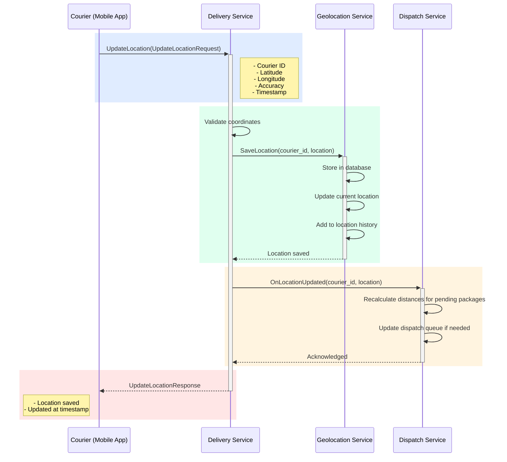

## Use Case: UC-4 Update Courier Location

### Описание
Обновление геолокации курьера в реальном времени. Используется для отслеживания перемещений и диспетчеризации.

### Sequence Diagram



### Request

```protobuf
message UpdateLocationRequest {
  string courier_id = 1;
  Location location = 2;
}

message Location {
  double latitude = 1;
  double longitude = 2;
  double accuracy = 3; // meters
  google.protobuf.Timestamp timestamp = 4;
  optional double speed = 5; // km/h (optional)
  optional double heading = 6; // degrees 0-360 (optional)
}
```

### Response

```protobuf
message UpdateLocationResponse {
  string courier_id = 1;
  google.protobuf.Timestamp updated_at = 2;
  bool location_saved = 3;
}
```

### Интеграция с Geolocation Service

Delivery Service использует **Geolocation Service** для хранения и получения локаций курьеров:

- **Сохранение локации**: `GeolocationService.SaveLocation(courier_id, location)`
- **Получение текущей локации**: `GeolocationService.GetCourierLocation(courier_id)`
- **Получение локаций нескольких курьеров**: `GeolocationService.GetCourierLocations(courier_ids)`
- **История локаций**: `GeolocationService.GetLocationHistory(courier_id, time_range)`

### Business Rules

1. Координаты должны быть валидными:
   - Latitude: -90 to 90
   - Longitude: -180 to 180
2. Accuracy должна быть положительным числом
3. Timestamp должен быть текущим или в ближайшем прошлом
4. Сохраняется текущая локация курьера через **Geolocation Service**
5. Добавляется запись в историю локаций в **Geolocation Service**
6. При обновлении локации пересчитываются расстояния для ожидающих назначения посылок
7. Если курьер свободен, обновление может повлиять на диспетчеризацию
8. При ошибке сохранения в Geolocation Service операция считается неуспешной

### Location History

История локаций хранится для:
- Отслеживания маршрута курьера
- Анализа эффективности доставок
- Оптимизации маршрутов
- Отладки проблем с доставкой

**Рекомендации по частоте обновления:**
- В пути: каждые 30-60 секунд
- Стоит на месте: каждые 5 минут
- При доставке: каждые 10 секунд

### Error Cases

- `COURIER_NOT_FOUND`: Курьер не найден
- `INVALID_COORDINATES`: Некорректные координаты
- `INVALID_ACCURACY`: Некорректная точность
- `TIMESTAMP_IN_FUTURE`: Timestamp в будущем (более 5 минут)

