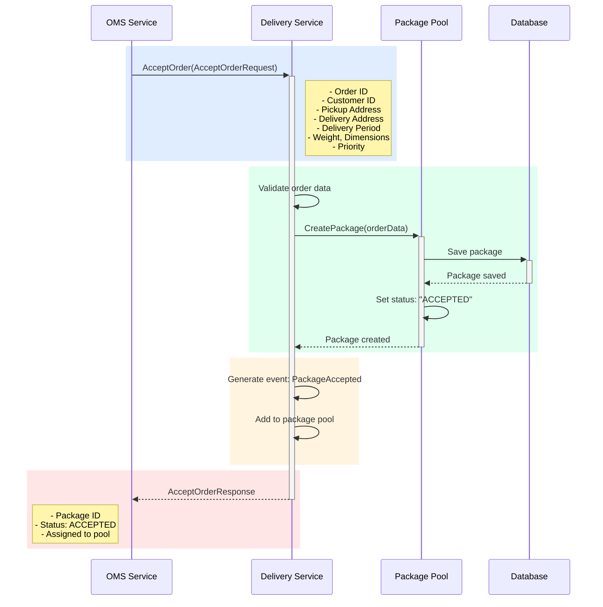

## Use Case: UC-1 Accept Order

### Description

Accepts an order from OMS for delivery. The order is added to the package pool with status "Accepted for delivery".

### Sequence Diagram



### Request

```protobuf
message AcceptOrderRequest {
  string order_id = 1;
  string customer_id = 2;
  Address pickup_address = 3;
  Address delivery_address = 4;
  DeliveryPeriod delivery_period = 5;
  PackageInfo package_info = 6;
  Priority priority = 7;
}

message Address {
  string street = 1;
  string city = 2;
  string postal_code = 3;
  string country = 4;
  double latitude = 5;
  double longitude = 6;
}

message DeliveryPeriod {
  google.protobuf.Timestamp start_time = 1; // Start of desired delivery period
  google.protobuf.Timestamp end_time = 2;   // End of desired delivery period
}

// Example:
// start_time: "2024-01-15T10:00:00Z" (10:00)
// end_time: "2024-01-15T12:00:00Z" (12:00)
// Means: delivery is preferred between 10:00 and 12:00

message PackageInfo {
  double weight_kg = 1;
  string dimensions = 2; // "LxWxH"
}

enum Priority {
  PRIORITY_NORMAL = 0;
  PRIORITY_URGENT = 1;
}
```

### Response

```protobuf
message AcceptOrderResponse {
  string package_id = 1;
  PackageStatus status = 2;
  google.protobuf.Timestamp created_at = 3;
}

enum PackageStatus {
  PACKAGE_STATUS_UNKNOWN = 0;
  PACKAGE_STATUS_ACCEPTED = 1;
  PACKAGE_STATUS_IN_POOL = 2;
  PACKAGE_STATUS_ASSIGNED = 3;
  PACKAGE_STATUS_IN_TRANSIT = 4;
  PACKAGE_STATUS_DELIVERED = 5;
  PACKAGE_STATUS_NOT_DELIVERED = 6;
  PACKAGE_STATUS_REQUIRES_HANDLING = 7;
}
```

### Business Rules

1. All required fields must be provided
2. Addresses must have valid coordinates (latitude, longitude)
3. **Delivery period:**
   - Must be in the future (start_time > current time)
   - start_time must be before end_time
   - Minimum duration: 1 hour
   - Maximum duration: 24 hours
   - Delivery period is used for prioritization and route planning
4. Weight and dimensions must be positive numbers
5. Upon creation, the package receives status `ACCEPTED`
6. A `PackageAccepted` event is generated to notify other services

### How to Specify Delivery Period

The delivery period is specified by the customer when placing an order in OMS and passed to the Delivery Service:

**Delivery Period Examples:**

1. **Morning delivery:**
   - start_time: "2024-01-15T09:00:00Z"
   - end_time: "2024-01-15T12:00:00Z"

2. **Afternoon delivery:**
   - start_time: "2024-01-15T12:00:00Z"
   - end_time: "2024-01-15T18:00:00Z"

3. **Evening delivery:**
   - start_time: "2024-01-15T18:00:00Z"
   - end_time: "2024-01-15T21:00:00Z"

4. **Urgent delivery (today):**
   - start_time: current time + 2 hours
   - end_time: current time + 4 hours

The delivery period is considered for:
- Dispatching (priority for packages with nearest delivery window)
- Courier route planning
- Courier notifications

### Error Cases

- `INVALID_REQUEST`: Invalid order data
- `INVALID_ADDRESS`: Address cannot be geocoded
- `INVALID_DELIVERY_PERIOD`: Delivery period is in the past
- `DUPLICATE_ORDER`: Order already exists in the system
