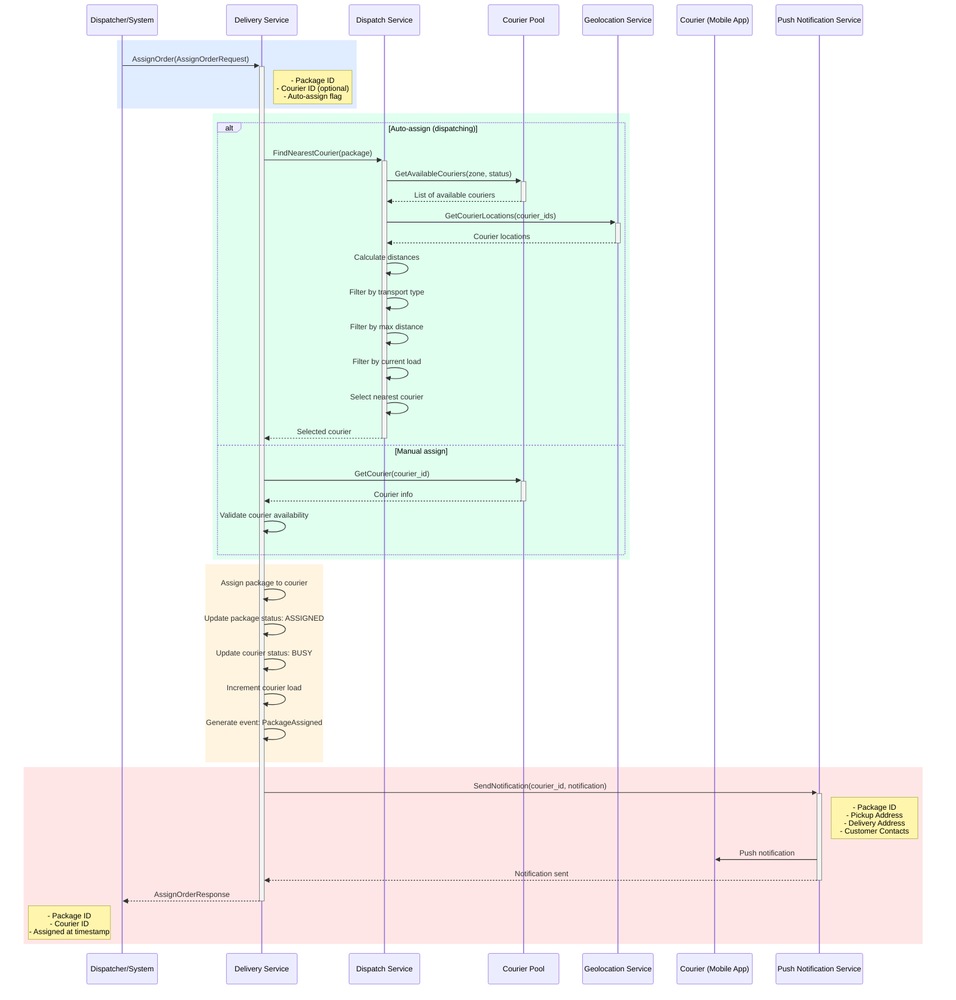

## Use Case: UC-2 Assign Order to Courier

### Description

Assigns a package to a courier. Can be automatic (dispatching) or manual. Upon assignment, the courier receives a push notification.

### Sequence Diagram



### Request

```protobuf
message AssignOrderRequest {
  string package_id = 1;
  oneof assignment_type {
    string courier_id = 2; // Manual assignment
    bool auto_assign = 3;   // Auto dispatch
  }
}

message AssignOrderResponse {
  string package_id = 1;
  string courier_id = 2;
  google.protobuf.Timestamp assigned_at = 3;
  PackageStatus status = 4;
}
```

### Dispatching (Auto-assign)

Algorithm for selecting the nearest courier:

1. **Filter by work zone:**
   - Get all free couriers in the delivery zone
   - Status: `FREE`
   - Work zone overlaps with delivery zone

2. **Calculate distance:**
   - Get current courier geolocation via **Geolocation Service**: `GetCourierLocations(courier_ids)`
   - Calculate distance from courier to pickup point
   - Use Haversine formula for distance calculation
   - If courier location is unavailable, skip courier from consideration

3. **Filter by capabilities:**
   - Courier transport type matches requirements
   - Distance to pickup point <= courier's maximum range
   - Current load < maximum load

4. **Sort and select:**
   - Sort by distance (nearest first)
   - Consider courier rating
   - Consider current load (load balancing)
   - Select optimal courier

### Business Rules

1. Courier must be in `FREE` status
2. Courier must be within working hours
3. Distance to pickup point must not exceed courier's maximum range
4. Courier's current load must be less than maximum
5. Upon assignment, package status changes to `ASSIGNED`
6. Courier status changes to `BUSY`
7. `PackageAssigned` event is generated
8. Push notification is sent to courier

### Push Notification Content

```json
{
  "title": "New order assigned",
  "body": "Order #{{package_id}} is ready for pickup",
  "data": {
    "package_id": "uuid",
    "pickup_address": "123 Example St",
    "pickup_coordinates": {
      "latitude": 55.7558,
      "longitude": 37.6173
    },
    "delivery_address": "456 Delivery Ave",
    "delivery_coordinates": {
      "latitude": 55.7600,
      "longitude": 37.6200
    },
    "customer_phone": "+1234567890",
    "delivery_period": {
      "start": "2024-01-15T10:00:00Z",
      "end": "2024-01-15T12:00:00Z"
    }
  }
}
```

### Error Cases

- `PACKAGE_NOT_FOUND`: Package not found
- `COURIER_NOT_FOUND`: Courier not found
- `COURIER_NOT_AVAILABLE`: Courier unavailable (busy/offline)
- `NO_AVAILABLE_COURIERS`: No available couriers in zone
- `INVALID_ASSIGNMENT`: Cannot assign (load exceeded, distance exceeded, etc.)
