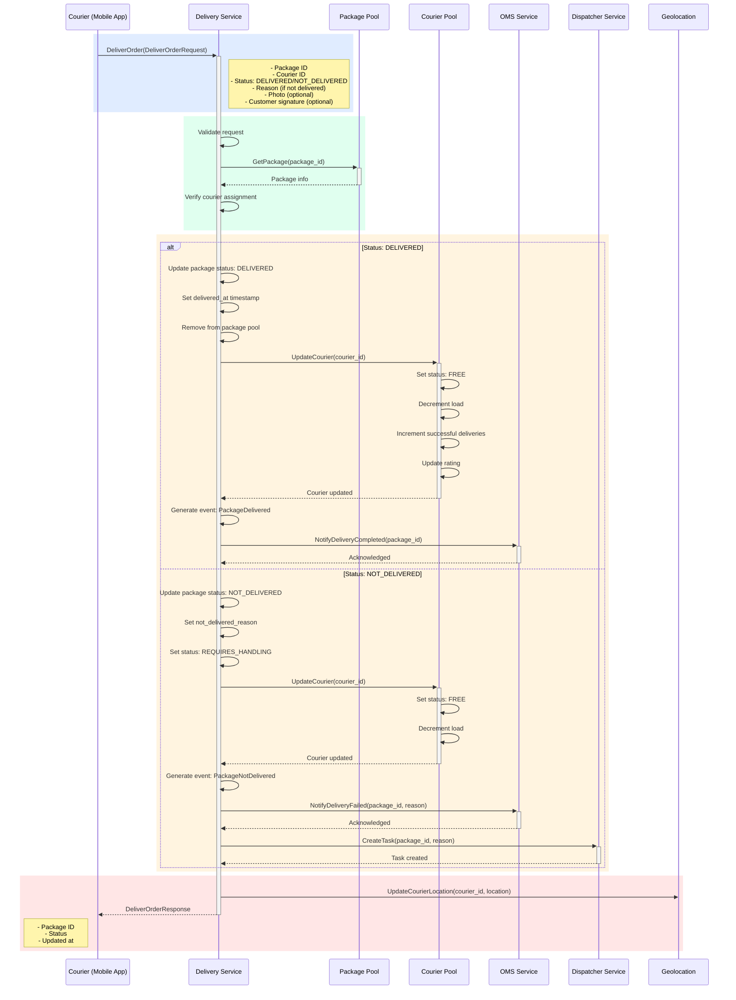

## Use Case: UC-3 Deliver Order

### Description

Courier confirms order delivery. Can be successful (delivered) or unsuccessful (not delivered with reason specified).

### Sequence Diagram



### Request

```protobuf
message DeliverOrderRequest {
  string package_id = 1;
  string courier_id = 2;
  DeliveryStatus status = 3;
  string reason = 4; // Required if status is NOT_DELIVERED
  bytes photo = 5; // Optional: delivery confirmation photo
  bytes customer_signature = 6; // Optional: customer signature
  Location current_location = 7; // Courier's current location after delivery
}

enum DeliveryStatus {
  DELIVERY_STATUS_UNKNOWN = 0;
  DELIVERY_STATUS_DELIVERED = 1;
  DELIVERY_STATUS_NOT_DELIVERED = 2;
}

message Location {
  double latitude = 1;
  double longitude = 2;
  double accuracy = 3; // meters
  google.protobuf.Timestamp timestamp = 4;
}
```

### Response

```protobuf
message DeliverOrderResponse {
  string package_id = 1;
  PackageStatus status = 2;
  google.protobuf.Timestamp updated_at = 3;
}
```

### NOT_DELIVERED Reasons

- `CUSTOMER_NOT_AVAILABLE` - Customer not available
- `WRONG_ADDRESS` - Wrong address
- `CUSTOMER_REFUSED` - Customer refused the order
- `ACCESS_DENIED` - No access to address
- `PACKAGE_DAMAGED` - Package is damaged
- `OTHER` - Other reason (description required)

### Business Rules

**On successful delivery (DELIVERED):**

1. Package status changes to `DELIVERED`
2. `delivered_at` timestamp is set
3. Package is removed from package pool
4. Courier status changes to `FREE`
5. Courier's current load is decremented
6. Successful deliveries counter is incremented
7. Courier rating is updated
8. `PackageDelivered` event is generated
9. Notification is sent to OMS about delivery completion
10. Courier location is updated

**On unsuccessful delivery (NOT_DELIVERED):**

1. Package status changes to `NOT_DELIVERED`
2. Not delivered reason is set
3. Status changes to `REQUIRES_HANDLING`
4. Package is returned to pool or marked for dispatcher handling
5. Courier status changes to `FREE`
6. Courier's current load is decremented
7. `PackageNotDelivered` event is generated
8. Notification is sent to OMS about the problem
9. Task is created for dispatcher
10. Courier location is updated

### Error Cases

- `PACKAGE_NOT_FOUND`: Package not found
- `COURIER_NOT_ASSIGNED`: Package is not assigned to this courier
- `INVALID_STATUS`: Invalid delivery status
- `REASON_REQUIRED`: Reason required when status is NOT_DELIVERED
- `ALREADY_DELIVERED`: Package already delivered
