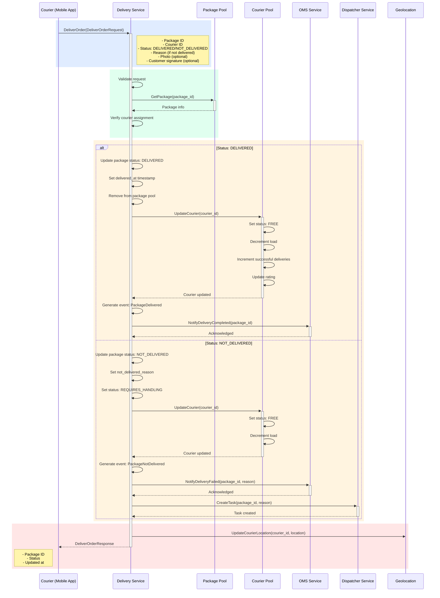

## Use Case: UC-3 Deliver Order

### Описание
Курьер подтверждает доставку заказа. Может быть успешной (доставлено) или неуспешной (не доставлено с указанием причины).

### Sequence Diagram



### Request

```protobuf
message DeliverOrderRequest {
  string package_id = 1;
  string courier_id = 2;
  DeliveryStatus status = 3;
  string reason = 4; // Required if status is NOT_DELIVERED
  bytes photo = 5; // Optional: delivery confirmation photo
  bytes customer_signature = 6; // Optional: customer signature
  Location current_location = 7; // Courier's current location after delivery
}

enum DeliveryStatus {
  DELIVERY_STATUS_UNKNOWN = 0;
  DELIVERY_STATUS_DELIVERED = 1;
  DELIVERY_STATUS_NOT_DELIVERED = 2;
}

message Location {
  double latitude = 1;
  double longitude = 2;
  double accuracy = 3; // meters
  google.protobuf.Timestamp timestamp = 4;
}
```

### Response

```protobuf
message DeliverOrderResponse {
  string package_id = 1;
  PackageStatus status = 2;
  google.protobuf.Timestamp updated_at = 3;
}
```

### Причины не доставки (NOT_DELIVERED)

- `CUSTOMER_NOT_AVAILABLE` - Клиент недоступен
- `WRONG_ADDRESS` - Неправильный адрес
- `CUSTOMER_REFUSED` - Клиент отказался от заказа
- `ACCESS_DENIED` - Нет доступа к адресу
- `PACKAGE_DAMAGED` - Посылка повреждена
- `OTHER` - Другая причина (требуется описание)

### Business Rules

**При успешной доставке (DELIVERED):**

1. Статус посылки меняется на `DELIVERED`
2. Устанавливается `delivered_at` timestamp
3. Посылка удаляется из пула посылок
4. Статус курьера меняется на `FREE`
5. Уменьшается текущая загрузка курьера
6. Увеличивается счетчик успешных доставок
7. Обновляется рейтинг курьера
8. Генерируется событие `PackageDelivered`
9. Отправляется уведомление в OMS о завершении доставки
10. Обновляется геолокация курьера

**При неуспешной доставке (NOT_DELIVERED):**

1. Статус посылки меняется на `NOT_DELIVERED`
2. Устанавливается причина не доставки
3. Статус меняется на `REQUIRES_HANDLING`
4. Посылка возвращается в пул или помечается для обработки диспетчером
5. Статус курьера меняется на `FREE`
6. Уменьшается текущая загрузка курьера
7. Генерируется событие `PackageNotDelivered`
8. Отправляется уведомление в OMS о проблеме
9. Создается задача для диспетчера
10. Обновляется геолокация курьера

### Error Cases

- `PACKAGE_NOT_FOUND`: Посылка не найдена
- `COURIER_NOT_ASSIGNED`: Посылка не назначена на этого курьера
- `INVALID_STATUS`: Некорректный статус доставки
- `REASON_REQUIRED`: Требуется указать причину при статусе NOT_DELIVERED
- `ALREADY_DELIVERED`: Посылка уже доставлена

