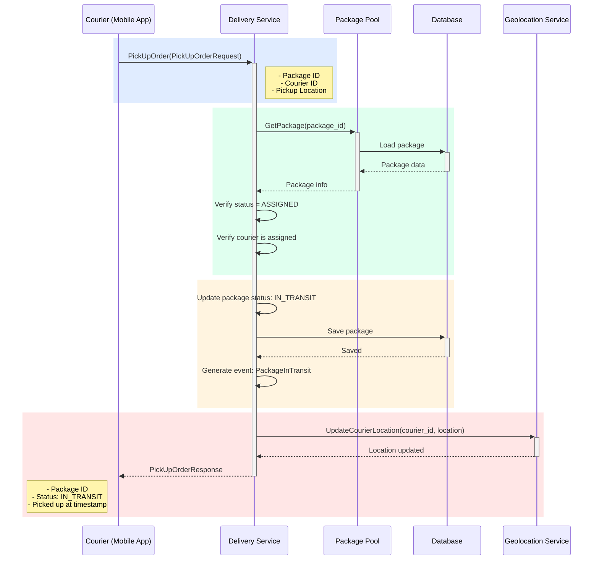

## Use Case: UC-4 Pick Up Order

### Description

Courier confirms package pickup at the pickup location. The package status changes from "Assigned" to "In Transit".

### Sequence Diagram



### Request

```protobuf
message PickUpOrderRequest {
  string package_id = 1;
  string courier_id = 2;
  Location pickup_location = 3;
}

message Location {
  double latitude = 1;
  double longitude = 2;
  double accuracy = 3; // meters
  google.protobuf.Timestamp timestamp = 4;
}
```

### Response

```protobuf
message PickUpOrderResponse {
  string package_id = 1;
  PackageStatus status = 2;
  google.protobuf.Timestamp picked_up_at = 3;
}
```

### Business Rules

1. Package must be in `ASSIGNED` status
2. Courier must be the one assigned to the package
3. Upon pickup, package status changes to `IN_TRANSIT`
4. `PackageInTransit` event is generated
5. Courier location is updated via Geolocation Service

### State Transition

```
ASSIGNED -> IN_TRANSIT
```

### Workflow Context

This use case is part of the delivery workflow:

1. **UC-1 Accept Order**: OMS sends order -> `ACCEPTED` -> `IN_POOL`
2. **UC-2 Assign Order**: Courier assigned -> `ASSIGNED`
3. **UC-4 Pick Up Order**: Courier picks up package -> `IN_TRANSIT` (this use case)
4. **UC-3 Deliver Order**: Courier delivers -> `DELIVERED` / `NOT_DELIVERED`

### Error Cases

- `PACKAGE_NOT_FOUND`: Package not found
- `COURIER_NOT_ASSIGNED`: Courier is not assigned to this package
- `INVALID_PACKAGE_STATUS`: Package is not in ASSIGNED status
- `ALREADY_PICKED_UP`: Package is already in transit
