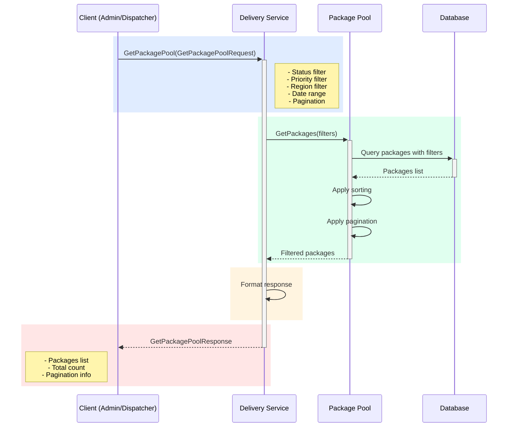

## Use Case: UC-6 Get Package Pool

### Description

Retrieve a list of packages in the pool with filtering capabilities by status, priority, region, and other parameters.

### Sequence Diagram



### Request

```protobuf
message GetPackagePoolRequest {
  repeated PackageStatus status_filter = 1;
  repeated Priority priority_filter = 2;
  string region_filter = 3;
  google.protobuf.Timestamp created_from = 4;
  google.protobuf.Timestamp created_to = 5;
  string courier_id = 6; // Filter by assigned courier
  Pagination pagination = 7;
  SortBy sort_by = 8;
}

message Pagination {
  int32 page = 1;
  int32 page_size = 2; // Max 100
}

enum SortBy {
  SORT_BY_UNKNOWN = 0;
  SORT_BY_CREATED_AT = 1;
  SORT_BY_PRIORITY = 2;
  SORT_BY_DELIVERY_PERIOD_START = 3;
  SORT_BY_DISTANCE = 4; // Requires courier location
}
```

### Response

```protobuf
message GetPackagePoolResponse {
  repeated Package packages = 1;
  int32 total_count = 2;
  PaginationInfo pagination = 3;
}

message Package {
  string package_id = 1;
  string order_id = 2;
  string customer_id = 3;
  Address pickup_address = 4;
  Address delivery_address = 5;
  DeliveryPeriod delivery_period = 6;
  PackageInfo package_info = 7;
  Priority priority = 8;
  PackageStatus status = 9;
  string courier_id = 10;
  google.protobuf.Timestamp created_at = 11;
  google.protobuf.Timestamp assigned_at = 12;
  google.protobuf.Timestamp delivered_at = 13;
  string not_delivered_reason = 14;
}

message PaginationInfo {
  int32 current_page = 1;
  int32 page_size = 2;
  int32 total_pages = 3;
  int32 total_items = 4;
}
```

### Filters

**Status Filter:**
- `ACCEPTED` - Accepted into pool
- `IN_POOL` - In pool, awaiting assignment
- `ASSIGNED` - Assigned to courier
- `IN_TRANSIT` - In transit
- `DELIVERED` - Delivered
- `NOT_DELIVERED` - Not delivered
- `REQUIRES_HANDLING` - Requires handling

**Priority Filter:**
- `NORMAL` - Regular packages
- `URGENT` - Urgent packages

**Region Filter:**
- Filter by delivery city/district

**Date Range:**
- Filter by package creation date

**Courier Filter:**
- Filter by assigned courier

### Business Rules

1. By default, packages with `IN_POOL` status are returned
2. Maximum page size: 100
3. Default sorting: by priority (urgent first), then by creation date
4. Sorting by distance requires courier coordinates
5. Priority packages are always shown first

### Use Cases

- **Dispatcher views pool:**
  - Filter: `IN_POOL`
  - Sort: by priority and date
  - Shows packages awaiting assignment

- **View assigned packages:**
  - Filter: `ASSIGNED`, `courier_id`
  - Shows all packages for a specific courier

- **Delivery analytics:**
  - Filter: `DELIVERED`, date range
  - Statistics of successful deliveries for a period

- **Problem handling:**
  - Filter: `REQUIRES_HANDLING`
  - Packages requiring dispatcher intervention

### Error Cases

- `INVALID_PAGINATION`: Invalid pagination parameters
- `INVALID_DATE_RANGE`: Invalid date range
- `INVALID_SORT_BY`: Invalid sort option
