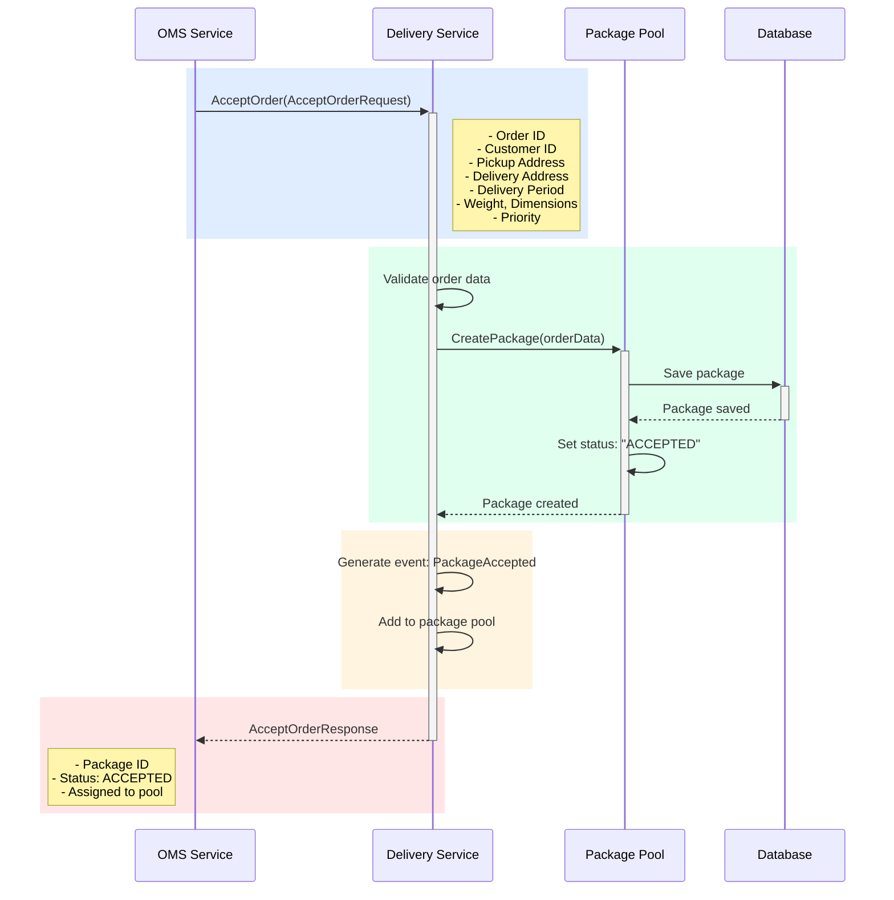

## Use Case: UC-1 Accept Order

### Описание
Прием заказа от OMS для доставки. Заказ добавляется в пул посылок со статусом "Принят к доставке".

### Sequence Diagram



### Request

```protobuf
message AcceptOrderRequest {
  string order_id = 1;
  string customer_id = 2;
  Address pickup_address = 3;
  Address delivery_address = 4;
  DeliveryPeriod delivery_period = 5;
  PackageInfo package_info = 6;
  Priority priority = 7;
}

message Address {
  string street = 1;
  string city = 2;
  string postal_code = 3;
  string country = 4;
  double latitude = 5;
  double longitude = 6;
}

message DeliveryPeriod {
  google.protobuf.Timestamp start_time = 1; // Начало желаемого периода доставки
  google.protobuf.Timestamp end_time = 2;   // Конец желаемого периода доставки
}

// Пример:
// start_time: "2024-01-15T10:00:00Z" (10:00)
// end_time: "2024-01-15T12:00:00Z" (12:00)
// Означает: доставка желательна с 10:00 до 12:00

message PackageInfo {
  double weight_kg = 1;
  string dimensions = 2; // "LxWxH"
}

enum Priority {
  PRIORITY_NORMAL = 0;
  PRIORITY_URGENT = 1;
}
```

### Response

```protobuf
message AcceptOrderResponse {
  string package_id = 1;
  PackageStatus status = 2;
  google.protobuf.Timestamp created_at = 3;
}

enum PackageStatus {
  PACKAGE_STATUS_UNKNOWN = 0;
  PACKAGE_STATUS_ACCEPTED = 1;
  PACKAGE_STATUS_IN_POOL = 2;
  PACKAGE_STATUS_ASSIGNED = 3;
  PACKAGE_STATUS_IN_TRANSIT = 4;
  PACKAGE_STATUS_DELIVERED = 5;
  PACKAGE_STATUS_NOT_DELIVERED = 6;
  PACKAGE_STATUS_REQUIRES_HANDLING = 7;
}
```

### Business Rules

1. Все обязательные поля должны быть заполнены
2. Адреса должны иметь валидные координаты (latitude, longitude)
3. **Период доставки:**
   - Должен быть в будущем (start_time > текущее время)
   - start_time должен быть раньше end_time
   - Минимальная длительность периода: 1 час
   - Максимальная длительность периода: 24 часа
   - Период доставки используется для приоритизации и планирования маршрутов
4. Вес и габариты должны быть положительными числами
5. При создании посылка получает статус `ACCEPTED`
6. Генерируется событие `PackageAccepted` для уведомления других сервисов

### Как указать период доставки

Период доставки указывается клиентом при оформлении заказа в OMS и передается в Delivery Service:

**Примеры периодов доставки:**

1. **Утренняя доставка:**
   - start_time: "2024-01-15T09:00:00Z"
   - end_time: "2024-01-15T12:00:00Z"

2. **Дневная доставка:**
   - start_time: "2024-01-15T12:00:00Z"
   - end_time: "2024-01-15T18:00:00Z"

3. **Вечерняя доставка:**
   - start_time: "2024-01-15T18:00:00Z"
   - end_time: "2024-01-15T21:00:00Z"

4. **Срочная доставка (сегодня):**
   - start_time: текущее время + 2 часа
   - end_time: текущее время + 4 часа

Период доставки учитывается при:
- Диспетчеризации (приоритет посылкам с ближайшим периодом)
- Планировании маршрутов курьеров
- Уведомлениях курьерам

### Error Cases

- `INVALID_REQUEST`: Невалидные данные заказа
- `INVALID_ADDRESS`: Адрес не может быть геокодирован
- `INVALID_DELIVERY_PERIOD`: Период доставки в прошлом
- `DUPLICATE_ORDER`: Заказ уже существует в системе

