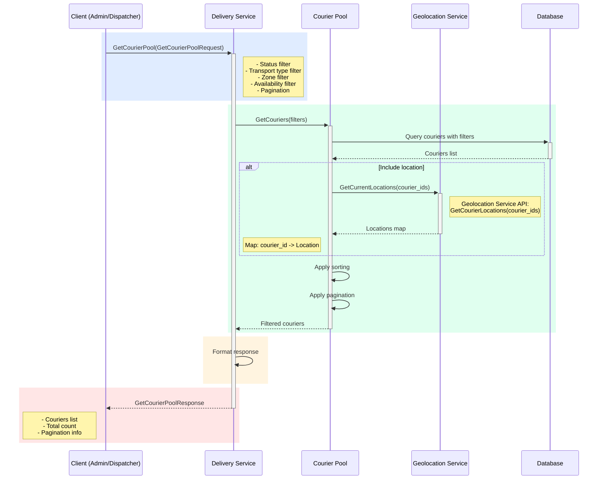

## Use Case: UC-7 Get Courier Pool

### Описание
Получение списка курьеров с возможностью фильтрации по статусу, типу транспорта, зоне работы и другим параметрам.

### Sequence Diagram



### Request

```protobuf
message GetCourierPoolRequest {
  repeated CourierStatus status_filter = 1;
  repeated TransportType transport_type_filter = 2;
  string zone_filter = 3;
  bool available_only = 4; // Only FREE couriers
  bool include_location = 5; // Include current location
  Pagination pagination = 6;
  SortBy sort_by = 7;
}

message Pagination {
  int32 page = 1;
  int32 page_size = 2; // Max 100
}

enum SortBy {
  SORT_BY_UNKNOWN = 0;
  SORT_BY_NAME = 1;
  SORT_BY_RATING = 2;
  SORT_BY_LOAD = 3;
  SORT_BY_SUCCESSFUL_DELIVERIES = 4;
}
```

### Response

```protobuf
message GetCourierPoolResponse {
  repeated Courier couriers = 1;
  int32 total_count = 2;
  PaginationInfo pagination = 3;
}

message Courier {
  string courier_id = 1;
  string name = 2;
  string phone = 3;
  string email = 4;
  TransportType transport_type = 5;
  double max_distance_km = 6;
  CourierStatus status = 7;
  int32 current_load = 8;
  int32 max_load = 9;
  double rating = 10;
  WorkHours work_hours = 11;
  string work_zone = 12;
  Location current_location = 13; // If include_location = true
  int32 successful_deliveries = 14;
  int32 failed_deliveries = 15;
  google.protobuf.Timestamp created_at = 16;
  google.protobuf.Timestamp last_active_at = 17;
}

message PaginationInfo {
  int32 current_page = 1;
  int32 page_size = 2;
  int32 total_pages = 3;
  int32 total_items = 4;
}
```

### Filters

**Status Filter:**
- `FREE` - Свободен, готов к работе
- `BUSY` - Занят, выполняет доставку
- `UNAVAILABLE` - Недоступен (выходной, перерыв)

**Transport Type Filter:**
- `WALKING` - Пеший
- `BICYCLE` - Велосипед
- `MOTORCYCLE` - Мотоцикл
- `CAR` - Автомобиль

**Zone Filter:**
- Фильтрация по зоне работы курьера

**Available Only:**
- Только свободные курьеры (`FREE` статус)
- В рабочее время
- Текущая загрузка < максимальной

### Интеграция с Geolocation Service

При `include_location = true` используется **Geolocation Service**:
- Вызов: `GeolocationService.GetCourierLocations(courier_ids)`
- Возвращает текущие локации для всех запрошенных курьеров
- Если локация курьера недоступна, поле `current_location` будет пустым

### Business Rules

1. По умолчанию возвращаются все курьеры
2. Максимальный размер страницы: 100
3. Сортировка по умолчанию: по рейтингу (высокий первый), затем по загрузке
4. Геолокация включается только если `include_location = true`
5. При фильтрации по доступности учитываются рабочие часы
6. Если Geolocation Service недоступен, локации не включаются, но список курьеров все равно возвращается

### Use Cases

- **Диспетчер ищет свободных курьеров:**
  - Фильтр: `status = FREE`, `available_only = true`
  - Сортировка: по рейтингу
  - Показывает курьеров, готовых принять заказ

- **Просмотр курьеров в зоне:**
  - Фильтр: `zone_filter`, `status = FREE`
  - Показывает курьеров в конкретной зоне

- **Аналитика курьеров:**
  - Фильтр: все статусы
  - Сортировка: по успешным доставкам
  - Статистика работы курьеров

- **Мониторинг загрузки:**
  - Фильтр: `status = BUSY`
  - Сортировка: по загрузке
  - Показывает загруженность курьеров

### Error Cases

- `INVALID_PAGINATION`: Некорректные параметры пагинации
- `INVALID_SORT_BY`: Некорректная сортировка

