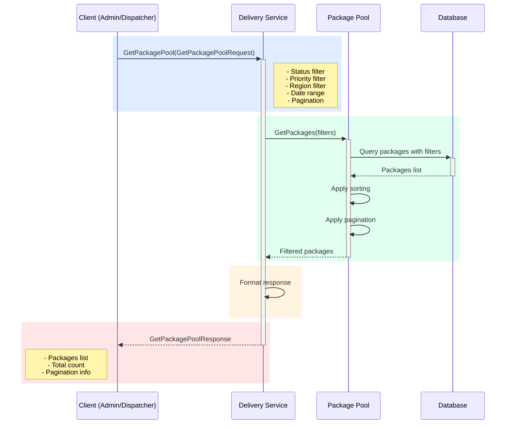

## Use Case: UC-6 Get Package Pool

### Описание
Получение списка посылок в пуле с возможностью фильтрации по статусу, приоритету, региону и другим параметрам.

### Sequence Diagram



### Request

```protobuf
message GetPackagePoolRequest {
  repeated PackageStatus status_filter = 1;
  repeated Priority priority_filter = 2;
  string region_filter = 3;
  google.protobuf.Timestamp created_from = 4;
  google.protobuf.Timestamp created_to = 5;
  string courier_id = 6; // Filter by assigned courier
  Pagination pagination = 7;
  SortBy sort_by = 8;
}

message Pagination {
  int32 page = 1;
  int32 page_size = 2; // Max 100
}

enum SortBy {
  SORT_BY_UNKNOWN = 0;
  SORT_BY_CREATED_AT = 1;
  SORT_BY_PRIORITY = 2;
  SORT_BY_DELIVERY_PERIOD_START = 3;
  SORT_BY_DISTANCE = 4; // Requires courier location
}
```

### Response

```protobuf
message GetPackagePoolResponse {
  repeated Package packages = 1;
  int32 total_count = 2;
  PaginationInfo pagination = 3;
}

message Package {
  string package_id = 1;
  string order_id = 2;
  string customer_id = 3;
  Address pickup_address = 4;
  Address delivery_address = 5;
  DeliveryPeriod delivery_period = 6;
  PackageInfo package_info = 7;
  Priority priority = 8;
  PackageStatus status = 9;
  string courier_id = 10;
  google.protobuf.Timestamp created_at = 11;
  google.protobuf.Timestamp assigned_at = 12;
  google.protobuf.Timestamp delivered_at = 13;
  string not_delivered_reason = 14;
}

message PaginationInfo {
  int32 current_page = 1;
  int32 page_size = 2;
  int32 total_pages = 3;
  int32 total_items = 4;
}
```

### Filters

**Status Filter:**
- `ACCEPTED` - Приняты в пул
- `IN_POOL` - В пуле, ожидают назначения
- `ASSIGNED` - Назначены курьеру
- `IN_TRANSIT` - В пути
- `DELIVERED` - Доставлены
- `NOT_DELIVERED` - Не доставлены
- `REQUIRES_HANDLING` - Требуют обработки

**Priority Filter:**
- `NORMAL` - Обычные
- `URGENT` - Срочные

**Region Filter:**
- Фильтрация по городу/району доставки

**Date Range:**
- Фильтрация по дате создания посылки

**Courier Filter:**
- Фильтрация по назначенному курьеру

### Business Rules

1. По умолчанию возвращаются посылки со статусом `IN_POOL`
2. Максимальный размер страницы: 100
3. Сортировка по умолчанию: по приоритету (срочные первые), затем по дате создания
4. При сортировке по расстоянию требуется указать координаты курьера
5. Приоритетные посылки всегда показываются первыми

### Use Cases

- **Диспетчер просматривает пул:**
  - Фильтр: `IN_POOL`
  - Сортировка: по приоритету и дате
  - Показывает посылки, ожидающие назначения

- **Просмотр назначенных посылок:**
  - Фильтр: `ASSIGNED`, `courier_id`
  - Показывает все посылки конкретного курьера

- **Аналитика доставок:**
  - Фильтр: `DELIVERED`, date range
  - Статистика успешных доставок за период

- **Обработка проблем:**
  - Фильтр: `REQUIRES_HANDLING`
  - Посылки, требующие вмешательства диспетчера

### Error Cases

- `INVALID_PAGINATION`: Некорректные параметры пагинации
- `INVALID_DATE_RANGE`: Некорректный диапазон дат
- `INVALID_SORT_BY`: Некорректная сортировка

