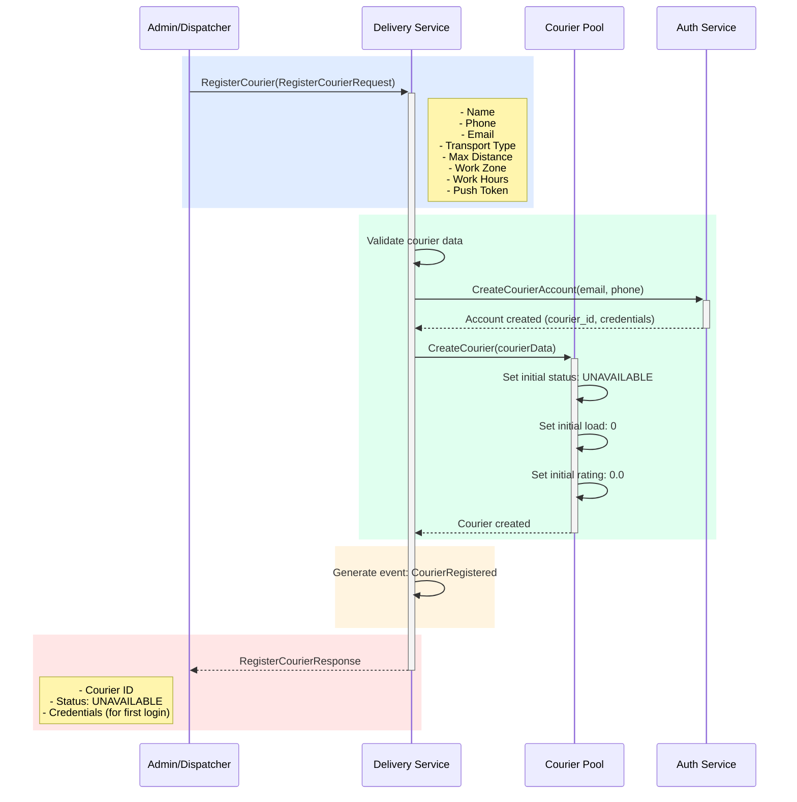

## Use Case: UC-5 Register Courier

### Описание
Регистрация нового курьера в системе. Курьер получает учетные данные и может начать принимать заказы.

### Sequence Diagram



### Request

```protobuf
message RegisterCourierRequest {
  string name = 1;
  string phone = 2;
  string email = 3;
  TransportType transport_type = 4;
  double max_distance_km = 5;
  string work_zone = 6; // Region/district
  WorkHours work_hours = 7;
  string push_token = 8; // FCM/APNS token for notifications
}

enum TransportType {
  TRANSPORT_TYPE_UNKNOWN = 0;
  TRANSPORT_TYPE_WALKING = 1;
  TRANSPORT_TYPE_BICYCLE = 2;
  TRANSPORT_TYPE_MOTORCYCLE = 3;
  TRANSPORT_TYPE_CAR = 4;
}

message WorkHours {
  string start_time = 1; // "09:00"
  string end_time = 2;   // "18:00"
  repeated int32 work_days = 3; // [1,2,3,4,5] - Monday to Friday
}
```

### Response

```protobuf
message RegisterCourierResponse {
  string courier_id = 1;
  CourierStatus status = 2;
  string temporary_password = 3; // For first login
  google.protobuf.Timestamp created_at = 4;
}

enum CourierStatus {
  COURIER_STATUS_UNKNOWN = 0;
  COURIER_STATUS_UNAVAILABLE = 1; // Initial status
  COURIER_STATUS_FREE = 2;
  COURIER_STATUS_BUSY = 3;
}
```

### Business Rules

1. Email и телефон должны быть уникальными
2. Email должен быть валидным форматом
3. Телефон должен быть в международном формате
4. Max distance должна быть положительным числом
5. Work hours должны быть валидными (start < end)
6. Push token должен быть валидным
7. При регистрации курьер получает статус `UNAVAILABLE`
8. Создается учетная запись в системе аутентификации
9. Генерируется временный пароль для первого входа
10. Генерируется событие `CourierRegistered`

### Initial Values

- **Status**: `UNAVAILABLE` (требует активации)
- **Current Load**: 0
- **Max Load**: зависит от типа транспорта:
  - Walking: 1
  - Bicycle: 2
  - Motorcycle: 3
  - Car: 5
- **Rating**: 0.0
- **Successful Deliveries**: 0
- **Failed Deliveries**: 0

### Error Cases

- `INVALID_EMAIL`: Некорректный формат email
- `INVALID_PHONE`: Некорректный формат телефона
- `EMAIL_EXISTS`: Email уже зарегистрирован
- `PHONE_EXISTS`: Телефон уже зарегистрирован
- `INVALID_TRANSPORT_TYPE`: Некорректный тип транспорта
- `INVALID_MAX_DISTANCE`: Некорректная максимальная дальность
- `INVALID_WORK_HOURS`: Некорректные рабочие часы

