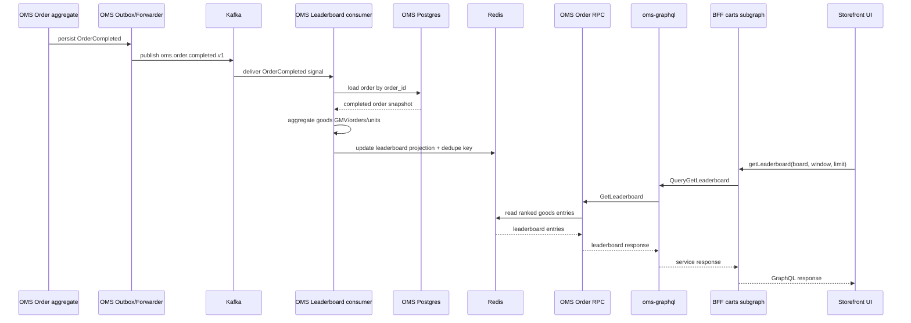

# 6. Goods leaderboard as Kafka-driven Redis read model

Date: 2026-03-11

## Status

Accepted

## Context

The storefront needs a leaderboard based on real purchases, not static UI mocks. The leaderboard is read-heavy, ranking-oriented, and does not belong inside the transactional `Order` aggregate. We already publish order lifecycle events from OMS into Kafka and use Redis in the shop boundary for derived read-side structures.

We also want to avoid reshaping core domain events just for a secondary read model. `OrderCompleted` should remain a domain fact, not a leaderboard-specific payload.

## Decision

We implement the goods leaderboard as a separate read model inside the OMS boundary with this flow:

1. **Signal**: OMS consumes `oms.order.completed.v1` from Kafka.
2. **Hydration**: the leaderboard consumer uses `order_id` from the event and loads the authoritative order snapshot from OMS storage via `OrderRepository`.
3. **Projection**: the consumer computes item-level metrics itself and stores leaderboard state in Redis.
4. **Serving API**: OMS exposes a read-only leaderboard query via internal order RPC; `oms-graphql` and the BFF proxy it to the UI.

This is intentionally a **goods leaderboard only**.

We do **not** implement storefront / merchant ranking in this ADR because current order item data contains `good_id`, `quantity`, and `price`, but no `storefront_id` / `merchant_id`.

## Architecture

### Services and components

- **OMS**
  - Publishes `OrderCompleted`
  - Consumes `OrderCompleted` again for leaderboard projection
  - Hydrates order state from Postgres
  - Stores leaderboard projection in Redis
  - Serves leaderboard query via gRPC
- **oms-graphql**
  - Maps OMS gRPC leaderboard response to the Connect/GraphQL contract
- **BFF**
  - Exposes `getLeaderboard(board, window, limit)` in the carts subgraph
- **UI**
  - Calls `getLeaderboard`
  - Resolves `goodId` to product metadata for presentation
- **Kafka**
  - Carries the `oms.order.completed.v1` integration event
- **Redis**
  - Serves leaderboard ranking and counters

### Data flow

```text
OMS OrderCompleted -> Kafka topic oms.order.completed.v1
                   -> OMS leaderboard consumer
                   -> load order from OMS Postgres
                   -> compute goods metrics
                   -> write Redis projection
                   -> query via OMS RPC -> oms-graphql -> BFF -> UI
```

### Sequence lifecycle



## Storage model

Redis is the serving store, not the source of truth.

We store:

- `ZSET` per metric and period for ranking
  - `shop:lb:v1:{goods}:gmv:day:{date}`
  - `shop:lb:v1:{goods}:gmv:week:{iso-week}`
  - `shop:lb:v1:{goods}:gmv:month:{yyyy-mm}`
  - same pattern for `orders` and `units`
- `generated_at` marker per period
- idempotency key
  - `shop:lb:v1:{goods}:processed:oms.order.completed.v1:{order_id}:{aggregate_version}`

All projection keys use the same Redis hash tag `{goods}` so multi-key Lua updates stay valid if Redis Cluster is introduced later.

## Metrics

Initial supported boards:

- `GOODS_GMV`
- `GOODS_ORDERS`
- `GOODS_UNITS`

Metrics are derived from the completed order snapshot:

- `gmv += unit_price * quantity`
- `orders += 1` per good per completed order
- `units += quantity`

## Why we hydrate from OMS instead of expanding OrderCompleted

We explicitly reject enriching `OrderCompleted` with leaderboard-specific fields for this use case.

Reasons:

- leaderboard is a secondary read model
- order events should remain domain-centered
- event contracts should not be widened just to save one read-side query
- OMS already owns the authoritative order snapshot, so hydration is cheap and unambiguous

## Idempotency and correctness

Projection updates are idempotent by `(order_id, aggregate_version)`.

Consequences:

- duplicate Kafka deliveries do not double-count leaderboard scores
- retries are safe
- projection logic remains eventually consistent and replay-friendly

`OrderCompleted` is treated as the terminal purchase signal. We do not derive leaderboard numbers from `OrderCreated`, because that would require cancel/compensation logic and would make read-side semantics less obvious.

## API contract

The external read path is:

`UI -> /api/graphql -> BFF -> oms-graphql -> OMS order RPC`

The exposed leaderboard query returns:

- board
- window
- generatedAt
- entries
  - memberId (`goodId`)
  - rank
  - score
  - orders
  - units

Presentation metadata such as product name, image, badge, note, or accent color is not part of the leaderboard projection itself.

## Consequences

### Positive

- keeps DDD boundaries clean: no leaderboard behavior in `Order`
- avoids event contract inflation
- uses Kafka as integration trigger and Redis as efficient serving layer
- supports replay/rebuild of projection logic
- keeps future extraction into a separate service possible

### Negative

- projection requires an additional read from OMS storage after the Kafka event
- UI currently enriches top goods separately by `goodId`, which may result in extra lookups
- storefront / merchant leaderboard still requires a future enrichment source

## Follow-up work

1. Add broader test coverage for the leaderboard query path and projection rebuild scenarios.
2. If storefront ranking becomes necessary, introduce a catalog/admin enrichment mapping `good -> storefront`.
3. If load grows, move product metadata enrichment out of the UI into a dedicated server-side join.
