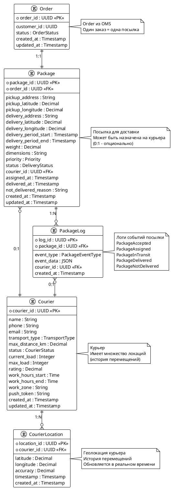

# План функциональности по сервисам Shop Boundary

## Обзор

Данный документ описывает текущее состояние функциональности сервисов и план по добавлению недостающих возможностей.

---

## 1. Каталог товаров (Admin Service)

**ADR:**
- [ADR-0001: Init](../admin/docs/ADR/decisions/0001-init.md) - Инициализация сервиса для управления товарами и ценами
- [ADR-0003: REST Framework](../admin/docs/ADR/decisions/0003-rest-framework.md) - Выбор Django REST Framework для Public API
- [ADR-0004: C4 System](../admin/docs/ADR/decisions/0004-c4-system.md) - Архитектура Admin Service

### Текущее состояние ✅

- **UC-1: Manage goods** - Управление товарами через админку
  - Создание, редактирование, удаление товаров
  - Управление через Django Admin Service

### Для пользователя (UI Service)

- ✅ **Получить карточку товара**
  - Реализовано через UI Service (Next.js)
  - GraphQL запрос: `goods_goods_retrieve(id: Int!)`
  - Endpoint: `/product/[id]`
  - Функция: `getGood(id)` в `ui/lib/shopify/index.ts`

- ✅ **Выбрать товар (добавить в корзину)**
  - Реализовано через Cart workflows
  - Событие: `AddItems` в OMS Cart Service
  - Можно добавить товар в корзину через UI

### Требуется добавить ❌

- [ ] Документация API для получения каталога товаров (список товаров с фильтрацией)
- [ ] Поиск товаров по каталогу
- [ ] Фильтрация и сортировка товаров

---

## 2. Корзина (OMS - Cart Service)

**ADR:**
- [ADR-0001: Init project](../oms/docs/ADR/decisions/0001-init.md) - Инициализация OMS для централизованного управления заказами
- [ADR-0002: C4 System](../oms/docs/ADR/decisions/0002-c4-system.md) - Архитектура OMS с Cart и Order workflows

### Текущее состояние ✅

- ✅ **Изменить состав корзины**
  - `AddItems` - Добавить товары в корзину
  - `RemoveItems` - Удалить товары из корзины
  - `ResetCart` - Очистить корзину
  - Реализовано через Temporal workflows (UC-1: Cart workflows)

- ✅ **Получить состав корзины**
  - `GetCart` - Получить состояние корзины
  - Возвращает: `cart_id`, `user_id`, `items`, `created_at`, `updated_at`
  - Реализовано через Temporal query handler

- ✅ **Оформить корзину (Checkout)**
  - Добавлен адрес доставки при оформлении заказа
  - Выбор периода доставки (дата + слот)
  - Переход от корзины к заказу с данными доставки
  - Валидация данных доставки (в т.ч. контакты получателя) перед созданием заказа
  - Order workflow передаёт данные доставки в Delivery Service (AcceptOrder)

---

## 3. Заказы (OMS - Order Service)

**ADR:**
- [ADR-0001: Init project](../oms/docs/ADR/decisions/0001-init.md) - Инициализация OMS для централизованного управления заказами
- [ADR-0002: C4 System](../oms/docs/ADR/decisions/0002-c4-system.md) - Архитектура OMS с Cart и Order workflows

### Текущее состояние ✅

- ✅ **Создать заказ**
  - `CreateOrder()` - Создание заказа из корзины
  - Workflow: Pending → Processing → Completed/Cancelled
  - Интеграция с Billing Service для оплаты
  - Интеграция с LogisticsService (Delivery Service) для доставки

- ✅ **Отменить заказ**
  - `CancelOrder()` - Отмена заказа
  - Обработка возврата средств через Billing Service

- ✅ **Получить заказ**
  - `Get()` - Получение информации о заказе по ID

- ✅ **Расширение CreateOrderRequest**
  - Адрес доставки (`delivery_address`)
  - Период доставки (`delivery_period`)
  - Контактная информация получателя (`recipient_contacts`)

---

## 4. Доставка (Delivery Service - Delivery Boundary)

**ADR:**
- ⚠️ **ADR для Delivery Service отсутствует** - требуется создать при реализации сервиса

**Связанные ADR:**
- [ADR-0001: Init Shop Boundary context](./ADR/decisions/0001-init.md) - Общее описание Shop Boundary
- [ADR-0002: C4 Model](./ADR/decisions/0002-c4-model.md) - Архитектура Shop Boundary с Delivery Service

### Текущее состояние ⚠️

- ⚠️ **Delivery Service** упоминается как внешний сервис в Delivery Boundary
- ⚠️ В C4 диаграмме указана интеграция: `oms_temporal → delivery_service: "Sends order info for delivery to"`
- ⚠️ В Order workflow есть вызов: `LogisticsService.ScheduleDelivery()`
- ❌ **Нет детальной документации** о функциональности Delivery Service

### Требуется добавить ❌

- [ ] **Пул посылок (Package Pool)**
  - Управление пулом заказов, ожидающих доставки
  - API для получения списка посылок в пуле
  - Фильтрация посылок по статусу, приоритету, региону
  - Группировка посылок по маршрутам
  - Оптимизация маршрутов доставки
  - Приоритизация заказов (срочные, обычные)
  - Распределение посылок по курьерам

- [ ] **Пул курьеров (Courier Pool)**
  - Управление пулом курьеров
  - Регистрация курьеров с параметрами:
    - **Расстояние** - максимальная дальность доставки
    - **Тип транспорта** - пеший, велосипед, автомобиль, мотоцикл
    - **Геолокация** - текущее местоположение (GPS координаты) в реальном времени
      - Обновление местоположения через API
      - Отслеживание перемещения курьера
      - Расчет расстояния до точки забора на основе геолокации
    - **Статус** - статус доступности курьера:
      - `свободен` - готов к принятию новых заказов
      - `занят` - выполняет доставку
      - `недоступен` - не работает (выходной, перерыв)
    - Текущая загрузка (количество активных доставок)
    - Рейтинг курьера
    - Рабочие часы
    - Зона работы (регион/район)
  - API для получения списка доступных курьеров
  - Фильтрация курьеров по параметрам
  - **Диспетчеризация** - автоматическое назначение на ближайшего свободного курьера
    - Алгоритм поиска ближайшего свободного курьера
    - Учет геолокации курьера и точки забора
    - Учет статуса курьера (только свободные)
    - Учет типа транспорта и максимальной дальности
  - Управление статусами курьеров

- [ ] **Принять заказ (Accept Order)**
  - API endpoint для приема заказа от OMS
  - Валидация данных заказа
  - Создание записи о доставке
  - Добавление заказа в пул посылок
  - Переход заказа в статус "Принят к доставке"

- [ ] **Назначить заказ на курьера (Assign Order)**
  - API endpoint для назначения курьера
  - **Диспетчеризация** - алгоритм выбора ближайшего свободного курьера:
    - Поиск всех свободных курьеров в зоне доставки
    - Расчет расстояния от текущей геолокации курьера до точки забора
    - Учет типа транспорта курьера и его возможностей
    - Учет текущей загрузки курьера
    - Учет зоны работы курьера
    - Учет рейтинга курьера
    - Выбор ближайшего свободного курьера
  - Автоматическое назначение (диспетчеризация) или ручное
  - Назначение заказа курьеру
  - **Событие при назначении посылки:**
    - Генерация события `PackageAssigned` при назначении посылки на курьера
    - **Push-уведомление** курьеру о новом назначенном заказе
    - Уведомление содержит: ID заказа, адрес забора, адрес доставки, контакты клиента
  - Переход заказа в статус "Назначен курьеру"
  - Обновление статуса курьера (свободен → занят)
  - Обновление геолокации курьера (если необходимо)

- [ ] **Доставить заказ (Deliver Order)**
  - API endpoint для подтверждения доставки курьером
  - **Курьер подтверждает доставку:**
    - Курьер может изменить статус доставки:
      - `доставлено` - заказ успешно доставлен клиенту
      - `не доставлено` - заказ не был доставлен (причины: клиент не доступен, неправильный адрес, отказ клиента и т.д.)
    - Указание причины при статусе "не доставлено"
    - Фото подтверждения доставки (опционально)
  - Получение подтверждения от клиента (опционально)
  - **Обработка статусов:**
    - При статусе "доставлено":
      - Переход заказа в статус "Доставлен"
      - Удаление заказа из пула посылок
      - Обновление статуса курьера (занят → свободен)
      - Обновление статистики курьера (успешные доставки)
      - Уведомление OMS о завершении доставки
    - При статусе "не доставлено":
      - Переход заказа в статус "Не доставлено"
      - Возврат заказа в пул посылок или в статус "Требует обработки"
      - Обновление статуса курьера (занят → свободен)
      - Уведомление OMS о проблеме с доставкой
      - Создание задачи для диспетчера на обработку
  - Обновление геолокации курьера (текущее местоположение после доставки)

- [ ] **Сервис эмуляции курьеров (Courier Emulation Service)**
  - Сервис для тестовой эмуляции поведения курьеров
  - Автоматическое обновление геолокации по маршрутам
  - Эмуляция движения курьеров по реальным дорогам
  - Автоматическое принятие назначенных заказов
  - Эмуляция доставки заказов
  - Генерация базы маршрутов на основе OSM данных
  - Интеграция с OSRM для расчета маршрутов

**План реализации:**

1. **Создать/обновить Delivery Service документацию:**
   - **ADR для Delivery Service** (требуется создать):
     - ADR-0001: Init Delivery Service - Инициализация сервиса доставки
     - ADR-0002: C4 System - Архитектура Delivery Service
     - ADR-0003: Диспетчеризация и геолокация - Алгоритмы назначения курьеров
   - Use Cases для операций доставки
   - API спецификация (gRPC/GraphQL)

2. **Определить workflow доставки:**

   ```
   Принят → В пуле → Назначен курьеру → В пути → Доставлено / Не доставлено

   При статусе "Не доставлено":
   Не доставлено → Требует обработки → (возврат в пул или отмена)
   ```

   **События и уведомления:**
   - `PackageAccepted` - посылка принята в пул
   - `PackageAssigned` - посылка назначена на курьера → **Push-уведомление курьеру**
   - `PackageInTransit` - посылка в пути
   - `PackageDelivered` - посылка доставлена → Уведомление OMS
   - `PackageNotDelivered` - посылка не доставлена → Уведомление OMS и диспетчера

3. **Интеграция с OMS:**
   - Расширить Order workflow для взаимодействия с Delivery Service
   - Добавить статусы доставки в Order State
   - Реализовать уведомления о статусе доставки

4. **Модель данных для доставки:**
   - **Посылка (Package):**
     - ID заказа
     - Адрес забора (с координатами)
     - Адрес доставки (с координатами)
     - Период доставки (желаемое время)
     - Вес и габариты
     - Приоритет (срочный, обычный)
     - **Статус доставки:**
       - `принят` - принят в пул
       - `назначен курьеру` - назначен на курьера
       - `в пути` - курьер забрал и везет
       - `доставлено` - успешно доставлено
       - `не доставлено` - не доставлено (требует обработки)
     - Назначенный курьер
     - Время создания
     - Время назначения на курьера
     - Время доставки
     - Причина не доставки (если статус "не доставлено")
   
   - **Курьер (Courier):**
     - ID курьера
     - Имя и контакты
     - Тип транспорта (пеший, велосипед, автомобиль, мотоцикл)
     - Максимальная дальность доставки (в км)
     - **Геолокация:**
       - Текущее местоположение (GPS координаты: широта, долгота)
       - Время последнего обновления геолокации
       - История перемещений (опционально)
     - **Статус:**
       - `свободен` - готов к принятию новых заказов
       - `занят` - выполняет доставку
       - `недоступен` - не работает
     - Текущая загрузка (количество активных доставок)
     - Максимальная загрузка
     - Рейтинг курьера
     - Рабочие часы
     - Зона работы (регион/район)
     - Список активных доставок
     - Токен для push-уведомлений

### 5. Схема данных (ERD)



**Описание связей:**

- **Order --1:1--> Package**: Один заказ соответствует одной посылке (один к одному)
- **Package --0:1--> Courier**: Посылка может быть назначена на курьера (многие к одному, опционально)
- **Courier --1:N--> CourierLocation**: Курьер имеет множество записей геолокации (один ко многим)
- **Package --1:N--> PackageLog**: Посылка имеет множество логов событий (один ко многим)
- **PackageLog --0:1--> Courier**: Лог события может быть связан с курьером (опционально)

**Типы данных:**

- `OrderStatus`: PENDING, PROCESSING, COMPLETED, CANCELLED
- `DeliveryStatus`: ACCEPTED, ASSIGNED, IN_TRANSIT, DELIVERED, NOT_DELIVERED
- `CourierStatus`: AVAILABLE, BUSY, UNAVAILABLE
- `TransportType`: FOOT, BICYCLE, MOTORCYCLE, CAR
- `Priority`: URGENT, NORMAL
- `PackageEventType`: PACKAGE_ACCEPTED, PACKAGE_ASSIGNED, PACKAGE_IN_TRANSIT, PACKAGE_DELIVERED, PACKAGE_NOT_DELIVERED

---

## Матрица функциональности

| Функциональность | Сервис | Статус | Приоритет |
|------------------|--------|--------|-----------|
| Управление каталогом товаров | Admin Service | ✅ Реализовано | - |
| Получить карточку товара | UI Service | ✅ Реализовано | - |
| Выбрать товар (добавить в корзину) | OMS Cart | ✅ Реализовано | - |
| Изменить состав корзины | OMS Cart | ✅ Реализовано | - |
| Получить состав корзины | OMS Cart | ✅ Реализовано | - |
| Оформить корзину с адресом доставки | OMS Order | ✅ Реализовано | - |
| Оформить корзину с периодом доставки | OMS Order | ✅ Реализовано | - |
| Пул посылок | Delivery Service | ❌ Требуется | Высокий |
| Пул курьеров | Delivery Service | ❌ Требуется | Высокий |
| Геолокация курьера | Delivery Service | ❌ Требуется | Высокий |
| Статус курьера | Delivery Service | ❌ Требуется | Высокий |
| Диспетчеризация (назначение на ближайшего свободного) | Delivery Service | ❌ Требуется | Высокий |
| Push-уведомление при назначении посылки | Delivery Service | ❌ Требуется | Высокий |
| Принять заказ | Delivery Service | ❌ Требуется | Высокий |
| Назначить заказ на курьера | Delivery Service | ❌ Требуется | Высокий |
| Доставить заказ (статус: доставлено/не доставлено) | Delivery Service | ❌ Требуется | Высокий |
| Сервис эмуляции курьеров | Courier Emulation Service | ❌ Требуется | Средний |
| Генерация маршрутов для эмуляции | Courier Emulation Service | ❌ Требуется | Средний |

---

## План реализации

### Этап 1: Расширение OMS для оформления корзины (1-2 недели)

1. **Обновить модель данных заказа:**
   - Добавить поля `delivery_address` и `delivery_period` в `CreateOrderRequest`
   - Обновить proto файлы: `oms/internal/infrastructure/rpc/order/v1/model/v1/model.proto`

2. **Обновить Order workflow:**
   - Добавить валидацию адреса доставки
   - Передать данные доставки в Delivery Service
   - Обновить `oms/internal/workers/order/workflow/workflow.go`

3. **Обновить UI:**
   - Добавить форму ввода адреса доставки
   - Добавить выбор периода доставки
   - Интегрировать с checkout процессом

### Этап 2: Реализация Delivery Service (3-4 недели)

1. **Создать документацию:**
   - ADR для Delivery Service
   - Use Cases для операций доставки
   - API спецификация (gRPC/GraphQL)
   - Модель данных для пула посылок и курьеров

2. **Реализовать модель данных:**
   - Модель Package (посылка) с полями:
     - ID заказа, адреса, период доставки, вес, габариты, приоритет, статус
   - Модель Courier (курьер) с полями:
     - ID, контакты, тип транспорта, максимальная дальность, местоположение, статус, загрузка, рейтинг, зона работы
   - База данных для хранения пулов

3. **Реализовать API endpoints:**
   
   **Управление пулом посылок:**
   - `GetPackagePool(filters)` - Получить список посылок в пуле
   - `GetPackage(package_id)` - Получить информацию о посылке
   - `UpdatePackageStatus(package_id, status)` - Обновить статус посылки
   - `GroupPackagesByRoute(criteria)` - Группировка посылок по маршрутам
   - `OptimizeRoutes(package_ids)` - Оптимизация маршрутов доставки
   
   **Управление пулом курьеров:**
   - `RegisterCourier(courier_info)` - Зарегистрировать курьера
   - `GetCourierPool(filters)` - Получить список курьеров
   - `GetCourier(courier_id)` - Получить информацию о курьере
   - `UpdateCourierLocation(courier_id, location)` - Обновить геолокацию курьера (GPS координаты)
   - `UpdateCourierStatus(courier_id, status)` - Обновить статус курьера (свободен/занят/недоступен)
   - `FindNearestAvailableCourier(package_info)` - Найти ближайшего свободного курьера для заказа (диспетчеризация)
   - `GetCourierWorkload(courier_id)` - Получить текущую загрузку курьера
   - `GetCourierLocation(courier_id)` - Получить текущую геолокацию курьера
   
   **Операции с заказами:**
   - `AcceptOrder(order_id, delivery_info)` - Принять заказ (добавить в пул)
   - `AssignOrder(order_id, courier_id)` - Назначить курьера (вручную)
   - `AutoAssignOrder(order_id)` - Автоматическое назначение на ближайшего свободного курьера (диспетчеризация)
     - Генерирует событие `PackageAssigned`
     - Отправляет push-уведомление курьеру
   - `DeliverOrder(order_id, status, reason)` - Подтвердить доставку курьером
     - `status`: "доставлено" или "не доставлено"
     - `reason`: причина (если не доставлено)
   - `GetDeliveryStatus(order_id)` - Получить статус доставки
   - `CancelDelivery(order_id)` - Отменить доставку
   
   **События и уведомления:**
   - `PackageAssigned` - событие при назначении посылки → Push-уведомление курьеру
   - `PackageDelivered` - событие при доставке → Уведомление OMS
   - `PackageNotDelivered` - событие при не доставке → Уведомление OMS и диспетчера

4. **Реализовать алгоритмы:**
   - **Алгоритм диспетчеризации (подбор ближайшего свободного курьера):**
     - Получение списка всех курьеров со статусом "свободен"
     - Получение текущей геолокации каждого свободного курьера
     - Расчет расстояния от геолокации курьера до точки забора посылки
     - Фильтрация по типу транспорта и максимальной дальности доставки
     - Фильтрация по зоне работы курьера
     - Учет текущей загрузки курьера (приоритет менее загруженным)
     - Учет рабочего времени курьера
     - Выбор ближайшего свободного курьера
     - При равном расстоянии - приоритет по рейтингу курьера
   - **Алгоритм оптимизации маршрутов:**
     - Группировка близких адресов
     - Построение оптимальных маршрутов (TSP - Traveling Salesman Problem)
     - Учет времени доставки и приоритетов
   - **Балансировка нагрузки:**
     - Равномерное распределение заказов между курьерами
     - Учет загрузки и доступности курьеров

5. **Реализовать workflow доставки:**
   - State machine для статусов доставки:
     ```
     Принят → В пуле → Назначен курьеру → В пути → Доставлено / Не доставлено
     
     При статусе "Не доставлено":
     Не доставлено → Требует обработки → (возврат в пул или отмена)
     ```
   - **Система событий и уведомлений:**
     - Генерация событий при смене статусов
     - Push-уведомления курьерам через FCM/APNS
     - Webhook уведомления для OMS
     - Уведомления диспетчерам при проблемах
   - Интеграция с OMS для уведомлений
   - Управление пулом посылок:
     - Автоматическое распределение заказов (диспетчеризация)
     - Балансировка нагрузки между курьерами
     - Оптимизация маршрутов доставки
   - **Обновление геолокации курьеров:**
     - Периодическое обновление через API от мобильного приложения курьера
     - Отслеживание перемещения курьера в реальном времени
     - Использование геолокации для диспетчеризации

6. **Интеграция с OMS:**
   - Обновить Order workflow для вызова Delivery Service
   - Добавить обработку статусов доставки
   - Реализовать уведомления
   - Интеграция с геокодированием для расчета расстояний

### Этап 3: Тестирование и документация (1 неделя)

1. Интеграционное тестирование
2. Обновление документации
3. Code review

### Этап 4: Сервис эмуляции курьеров (Courier Emulation Service) (2-3 недели)

**Назначение:** Сервис для эмуляции поведения курьеров в тестовой среде. Имитирует движение курьеров, обновление геолокации, принятие заказов и подтверждение доставки.

**Функциональность:**
- Автоматическое обновление геолокации курьеров
- Эмуляция движения по маршрутам
- Автоматическое принятие назначенных заказов
- Эмуляция доставки заказов
- Изменение статусов курьеров

**Подробный план реализации:** См. [README.md](../courier-emulation/README.md)

**Основные компоненты:**

1. **Генерация базы маршрутов:**
   - Использование OSM данных (Berlin) и OSRM для генерации маршрутов
   - Создание базы маршрутов из случайных пар точек
   - Хранение маршрутов с polyline координатами

2. **Реализация сервиса эмуляции:**
   - Сервис на Go (аналогично другим сервисам Delivery Boundary)
   - gRPC API для управления эмулируемыми курьерами
   - Интеграция с Delivery Service для получения назначенных заказов
   - Интеграция с Geolocation Service для обновления локаций

3. **База маршрутов:**
   - Хранение сгенерированных маршрутов (Postgres/Redis/MinIO)
   - API для получения маршрутов по ID или случайного маршрута
   - Кэширование популярных маршрутов

4. **Эмуляция движения:**
   - Парсинг polyline в последовательность координат
   - Пошаговая эмуляция движения с учетом времени
   - Обновление геолокации с заданной частотой (например, каждые 30 секунд)
   - Учет типа транспорта для скорости движения

5. **Стратегии эмуляции:**
   - Всегда принимать заказы (для тестирования диспетчеризации)
   - Реалистичные задержки (имитация реального времени доставки)
   - Случайные отклонения от маршрута (для реалистичности)
   - Обработка ошибок доставки (опционально, для тестирования)

---

## Связанные документы

### Architecture Decision Records (ADR)

**Shop Boundary (общие):**
- [ADR-0001: Init Shop Boundary context](./ADR/decisions/0001-init.md) - Инициализация Shop Boundary с описанием всех сервисов
- [ADR-0002: C4 Model](./ADR/decisions/0002-c4-model.md) - Архитектура Shop Boundary (System Context и Container диаграммы)
- [ADR-0003: Requirements](./ADR/decisions/0003-requirements.md) - Требования и расчеты потребления

**Admin Service:**
- [ADR-0001: Init](../admin/docs/ADR/decisions/0001-init.md) - Инициализация сервиса управления товарами
- [ADR-0003: REST Framework](../admin/docs/ADR/decisions/0003-rest-framework.md) - Выбор Django REST Framework
- [ADR-0004: C4 System](../admin/docs/ADR/decisions/0004-c4-system.md) - Архитектура Admin Service

**OMS (Order Management System):**
- [ADR-0001: Init project](../oms/docs/ADR/decisions/0001-init.md) - Инициализация OMS
- [ADR-0002: C4 System](../oms/docs/ADR/decisions/0002-c4-system.md) - Архитектура OMS

**Feed Service:**
- [ADR-0001: Init Feed Service](../feed/docs/ADR/decisions/0001-init.md) - Инициализация Feed Service для генерации фидов

**OMS-GraphQL:**
- [ADR-0001: Init project](../oms-graphql/docs/ADR/decisions/0001-init-project.md) - Инициализация OMS GraphQL API Bridge

### Use Cases и документация

- [OMS Cart Workflows](../oms/internal/usecases/cart/README.md) - UC-1: Cart workflows
- [OMS Order Workflows](../oms/internal/usecases/order/README.md) - UC-2: Order workflows
- [Admin Service Goods Management](../admin/src/domain/goods/README.md) - UC-1: Manage goods

---

## Примечания

- Delivery Service находится в отдельном Delivery Boundary и может быть реализован независимо
- Необходимо согласовать API контракт между OMS и Delivery Service
- Рекомендуется использовать gRPC для межсервисной коммуникации между OMS и Delivery Service
- Delivery Service может использовать Temporal для управления workflow доставки (аналогично OMS)
- **Геокодирование и геолокация:**
  - Для расчета расстояний и оптимизации маршрутов потребуется интеграция с сервисом геокодирования (Google Maps API, Yandex Maps API, или аналогичный)
  - Реальное время обновления геолокации курьеров через мобильное приложение
  - Расчет расстояний между точками на основе GPS координат
- **Push-уведомления:**
  - Интеграция с FCM (Firebase Cloud Messaging) или APNS (Apple Push Notification Service)
  - Отправка push-уведомлений курьерам при назначении посылки
  - Хранение токенов устройств курьеров в базе данных
- **События и уведомления:**
  - Event-driven архитектура для обработки событий доставки
  - Webhook для уведомления OMS о статусах доставки
  - Очередь событий для надежной доставки уведомлений
- **Типы транспорта курьеров:**
  - Пеший - для коротких расстояний, небольших посылок
  - Велосипед - для средних расстояний, средних посылок
  - Мотоцикл - для средних-длинных расстояний, средних посылок
  - Автомобиль - для длинных расстояний, крупных посылок
- **Максимальная дальность доставки** зависит от типа транспорта и должна быть настраиваемой для каждого курьера
- **Пул посылок** должен поддерживать приоритизацию (срочные заказы обрабатываются первыми)
- **Пул курьеров** должен обновлять геолокацию в реальном времени для оптимального назначения заказов
- **Диспетчеризация** - автоматическое назначение на ближайшего свободного курьера на основе геолокации
- **Статусы доставки:** Курьер может установить статус "доставлено" или "не доставлено" с указанием причины
- **Push-уведомления:** При назначении посылки на курьера отправляется push-уведомление с деталями заказа

