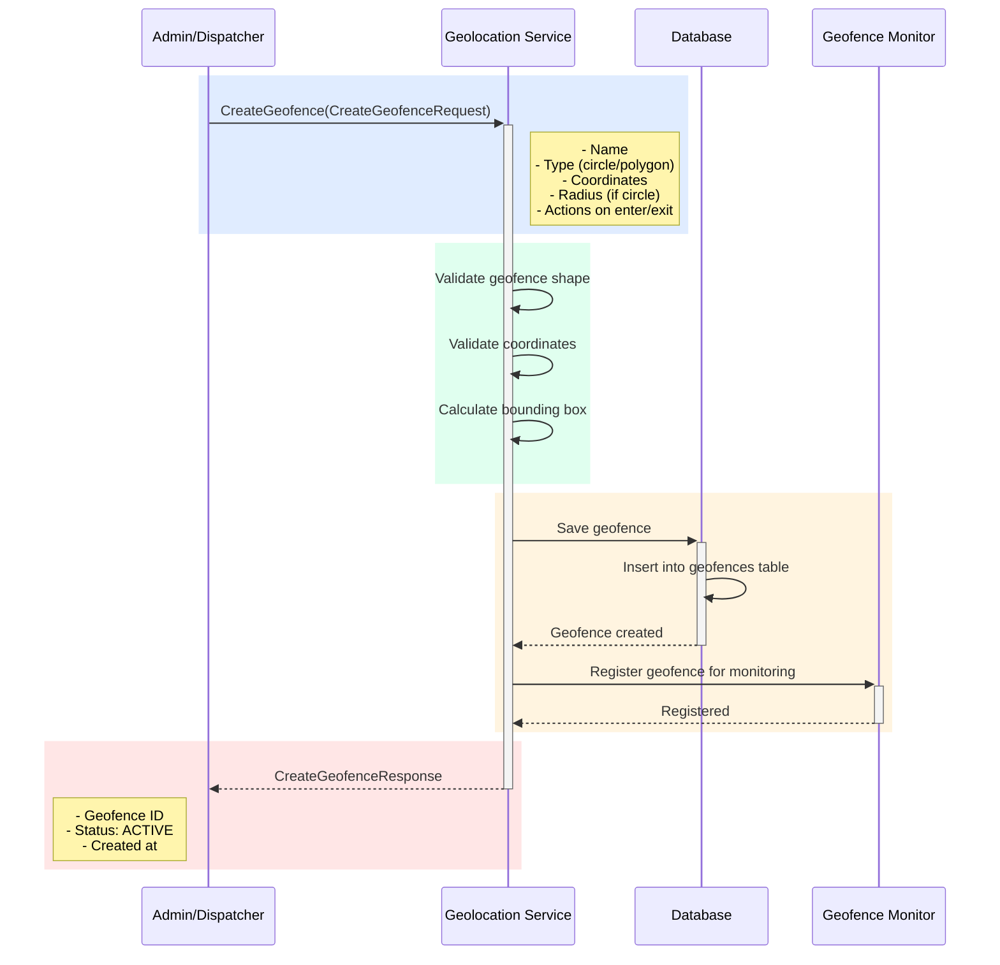

## Use Case: UC-4 Create Geofence

### Описание
Создание геозоны (geofence) — виртуальной географической границы на карте. Геозона позволяет отслеживать вход и выход курьеров из определенных областей и автоматически выполнять действия при пересечении границ.

### Что такое Geofence?

**Geofence (геозона)** — это виртуальная граница, определяющая область на карте. Геозона может быть:
- **Кругом** с центром и радиусом
- **Многоугольником** (полигоном) с набором координат
- **Прямоугольником** с двумя углами

Когда курьер с GPS устройством пересекает границу геозоны (входит или выходит), система может:
- Отправить уведомление
- Выполнить автоматическое действие
- Записать событие для аналитики
- Изменить статус курьера

### Примеры использования в Delivery Service

1. **Рабочие зоны курьеров:**
   - Определить зону работы курьера (например, район доставки)
   - Уведомлять, если курьер выходит за пределы зоны

2. **Зоны доставки:**
   - Создать геозону вокруг точки доставки
   - Автоматически отмечать прибытие курьера к месту доставки

3. **Складские зоны:**
   - Геозона вокруг склада
   - Автоматический учет времени нахождения курьера на складе

4. **Ограниченные зоны:**
   - Запрещенные для работы районы
   - Предупреждения при входе в такие зоны

### Sequence Diagram



### Request

```protobuf
message CreateGeofenceRequest {
  string name = 1; // Название геозоны (например, "Зона доставки Центр")
  GeofenceType type = 2; // Тип геозоны
  repeated Coordinate coordinates = 3; // Координаты для определения границ
  optional double radius_meters = 4; // Радиус в метрах (для CIRCLE)
  GeofenceActions actions = 5; // Действия при входе/выходе
  string description = 6; // Описание (опционально)
}

enum GeofenceType {
  GEOFENCE_TYPE_UNKNOWN = 0;
  GEOFENCE_TYPE_CIRCLE = 1; // Круг с центром и радиусом
  GEOFENCE_TYPE_POLYGON = 2; // Многоугольник (полигон)
  GEOFENCE_TYPE_RECTANGLE = 3; // Прямоугольник
}

message Coordinate {
  double latitude = 1;
  double longitude = 2;
}

message GeofenceActions {
  repeated GeofenceAction on_enter = 1; // Действия при входе в зону
  repeated GeofenceAction on_exit = 2; // Действия при выходе из зоны
}

message GeofenceAction {
  ActionType type = 1;
  string target = 2; // ID курьера, сервиса, webhook URL и т.д.
  string message = 3; // Сообщение для уведомления (опционально)
}

enum ActionType {
  ACTION_TYPE_UNKNOWN = 0;
  ACTION_TYPE_NOTIFY_COURIER = 1; // Уведомить курьера
  ACTION_TYPE_NOTIFY_DISPATCHER = 2; // Уведомить диспетчера
  ACTION_TYPE_SEND_EVENT = 3; // Отправить событие в систему
  ACTION_TYPE_WEBHOOK = 4; // Отправить webhook
  ACTION_TYPE_CHANGE_STATUS = 5; // Изменить статус курьера
}
```

### Response

```protobuf
message CreateGeofenceResponse {
  string geofence_id = 1;
  string name = 2;
  GeofenceStatus status = 3; // ACTIVE, INACTIVE
  google.protobuf.Timestamp created_at = 4;
}

enum GeofenceStatus {
  GEOFENCE_STATUS_UNKNOWN = 0;
  GEOFENCE_STATUS_ACTIVE = 1;
  GEOFENCE_STATUS_INACTIVE = 2;
}
```

### Business Rules

1. **Валидация формы:**
   - **CIRCLE:** Требуется 1 координата (центр) и радиус > 0
   - **POLYGON:** Требуется минимум 3 координаты, образуют замкнутый многоугольник
   - **RECTANGLE:** Требуется 2 координаты (нижний левый и верхний правый углы)

2. **Валидация координат:**
   - Все координаты должны быть валидными (latitude: -90 to 90, longitude: -180 to 180)
   - Полигон не должен пересекаться сам с собой
   - Минимальный размер геозоны: 10 метров в диаметре

3. **Именование:**
   - Название должно быть уникальным (или уникальным в рамках организации)
   - Название не должно быть пустым

4. **Действия:**
   - Можно указать несколько действий для входа и выхода
   - Действия выполняются асинхронно после события

5. **Статус:**
   - При создании геозона получает статус `ACTIVE`
   - Активная геозона начинает отслеживаться немедленно

### Хранение данных

**Таблица: `geofences`**
- `geofence_id` (PK)
- `name`
- `type` (CIRCLE, POLYGON, RECTANGLE)
- `coordinates` (JSON/JSONB массив координат)
- `radius_meters` (nullable, для CIRCLE)
- `bounding_box` (прямоугольная область для быстрого поиска)
- `actions` (JSON с действиями)
- `status` (ACTIVE, INACTIVE)
- `created_at`, `updated_at`

**Индексы:**
- Пространственный индекс на `bounding_box` для быстрого поиска геозон по координатам
- Индекс на `status` для фильтрации активных геозон

### Как работает отслеживание

1. **При сохранении локации курьера:**
   - Система проверяет все активные геозоны
   - Используется bounding box для быстрой фильтрации
   - Для оставшихся геозон проверяется, находится ли точка внутри

2. **Определение пересечения границы:**
   - Сохраняется последнее известное положение курьера относительно каждой геозоны
   - При изменении состояния (внутри → снаружи или наоборот) генерируется событие

3. **Выполнение действий:**
   - События обрабатываются асинхронно
   - Выполняются действия, указанные в `on_enter` или `on_exit`

### Примеры использования

**Пример 1: Создание рабочей зоны курьера (круг)**

```protobuf
CreateGeofenceRequest {
  name: "Рабочая зона - Центр города"
  type: GEOFENCE_TYPE_CIRCLE
  coordinates: [
    {latitude: 52.520008, longitude: 13.404954}
  ]
  radius_meters: 5000.0
  actions: {
    on_exit: [
      {
        type: ACTION_TYPE_NOTIFY_DISPATCHER
        message: "Курьер вышел за пределы рабочей зоны"
      }
    ]
  }
  description: "Основная зона работы курьеров в центре Берлина"
}
```

**Пример 2: Геозона точки доставки (полигон)**

```protobuf
CreateGeofenceRequest {
  name: "Точка доставки - ул. Примерная, 1"
  type: GEOFENCE_TYPE_POLYGON
  coordinates: [
    {latitude: 52.520008, longitude: 13.404954},
    {latitude: 52.520500, longitude: 13.404954},
    {latitude: 52.520500, longitude: 13.405500},
    {latitude: 52.520008, longitude: 13.405500},
    {latitude: 52.520008, longitude: 13.404954} // Замыкает полигон
  ]
  actions: {
    on_enter: [
      {
        type: ACTION_TYPE_SEND_EVENT
        target: "delivery_service"
        message: "Курьер прибыл к точке доставки"
      }
    ]
  }
}
```

**Пример 3: Запрещенная зона (прямоугольник)**

```protobuf
CreateGeofenceRequest {
  name: "Запрещенная зона - Автобан"
  type: GEOFENCE_TYPE_RECTANGLE
  coordinates: [
    {latitude: 52.510000, longitude: 13.400000}, // Нижний левый угол
    {latitude: 52.530000, longitude: 13.410000}  // Верхний правый угол
  ]
  actions: {
    on_enter: [
      {
        type: ACTION_TYPE_NOTIFY_COURIER
        message: "Внимание! Вы вошли в запрещенную зону"
      },
      {
        type: ACTION_TYPE_NOTIFY_DISPATCHER
        message: "Курьер вошел в запрещенную зону"
      }
    ]
  }
  description: "Автобан - запрещено для пешеходов и велосипедов"
}
```

### Error Cases

- `INVALID_GEOFENCE_TYPE`: Некорректный тип геозоны
- `INVALID_COORDINATES`: Некорректные координаты (вне диапазона, недостаточно точек)
- `INVALID_SHAPE`: Некорректная форма (например, полигон с пересечениями)
- `INVALID_RADIUS`: Радиус <= 0 или слишком большой
- `GEOFENCE_TOO_SMALL`: Геозона слишком мала (меньше 10 метров)
- `DUPLICATE_NAME`: Геозона с таким именем уже существует
- `INVALID_ACTIONS`: Некорректные действия

### Интеграция

**Используется в:**
- Delivery Service: создание рабочих зон для курьеров
- Dispatch Service: автоматические уведомления при выходе из зоны
- Analytics: отслеживание времени нахождения в зонах
- Admin панель: управление зонами доставки

**Работает совместно с:**
- `SaveLocation`: при сохранении локации проверяется пересечение геозон
- `CheckGeofence`: проверка текущего положения относительно геозоны

### Рекомендации

- Используйте CIRCLE для простых зон (склады, точки доставки)
- Используйте POLYGON для сложных форм (районы, рабочие зоны)
- Радиус для CIRCLE обычно 50-5000 метров
- Для полигонов используйте 10-100 точек для баланса точности и производительности
- Создавайте bounding box для оптимизации поиска

