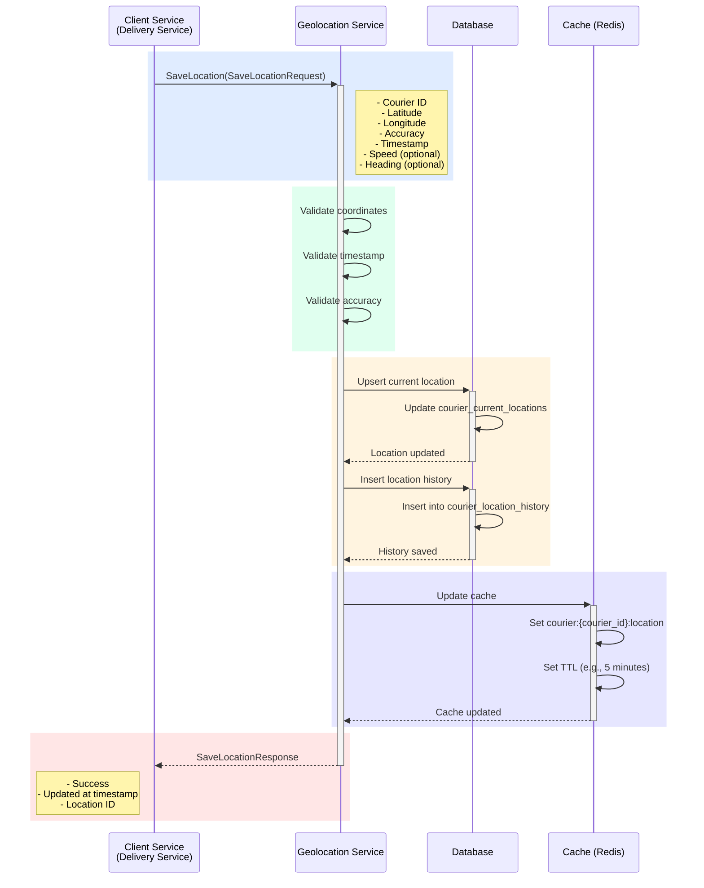

## Use Case: UC-1 Save Location

### Описание
Сохранение текущей геолокации курьера в системе. Обновляет текущую позицию курьера и добавляет запись в историю перемещений. Используется для отслеживания перемещений курьеров в реальном времени.

### Sequence Diagram



### Request

```protobuf
message SaveLocationRequest {
  string courier_id = 1;
  Location location = 2;
}

message Location {
  double latitude = 1;
  double longitude = 2;
  double accuracy = 3; // meters
  google.protobuf.Timestamp timestamp = 4;
  optional double speed = 5; // km/h (optional)
  optional double heading = 6; // degrees 0-360 (optional)
}
```

### Response

```protobuf
message SaveLocationResponse {
  string courier_id = 1;
  google.protobuf.Timestamp updated_at = 2;
  string location_id = 3; // ID записи в истории
  bool success = 4;
}
```

### Business Rules

1. **Валидация координат:**
   - Latitude должна быть в диапазоне: -90 to 90
   - Longitude должна быть в диапазоне: -180 to 180
   - Координаты должны быть валидными числами

2. **Валидация accuracy:**
   - Accuracy должна быть положительным числом (больше 0)
   - Максимальная accuracy: 1000 метров (если больше - вероятно ошибка GPS)

3. **Валидация timestamp:**
   - Timestamp должен быть текущим или в ближайшем прошлом (не более 5 минут назад)
   - Timestamp не должен быть в будущем (максимум +1 минута от текущего времени)

4. **Опциональные поля:**
   - Speed (скорость) должна быть >= 0 и <= 200 km/h (максимальная скорость транспорта)
   - Heading (направление) должна быть в диапазоне: 0-360 градусов

5. **Сохранение данных:**
   - Обновляется текущая локация курьера в таблице `courier_current_locations`
   - Добавляется запись в историю в таблицу `courier_location_history`
   - Обновляется кэш в Redis для быстрого доступа

6. **Оптимизация:**
   - Если новая локация очень близка к предыдущей (< 10 метров) и время прошло менее 1 минуты, можно пропустить запись в историю (опционально)
   - Использование батчинга для массовых обновлений

### Хранение данных

**Текущая локация:**
- Таблица: `courier_current_locations`
- Структура:
  - `courier_id` (PK)
  - `latitude`
  - `longitude`
  - `accuracy`
  - `timestamp`
  - `speed` (nullable)
  - `heading` (nullable)
  - `updated_at`
- Индексы: пространственный индекс на (latitude, longitude) для быстрых гео-запросов

**История локаций:**
- Таблица: `courier_location_history`
- Структура:
  - `location_id` (PK)
  - `courier_id` (FK)
  - `latitude`
  - `longitude`
  - `accuracy`
  - `timestamp`
  - `speed` (nullable)
  - `heading` (nullable)
  - `recorded_at` (время записи в БД)
- Индексы:
  - По `courier_id` и `timestamp` для быстрого получения истории
  - Партиционирование по дате для оптимизации

**Кэш:**
- Redis key: `courier:{courier_id}:location`
- TTL: 5 минут
- Формат: JSON с Location данными

### Производительность

**Рекомендации по частоте обновления:**
- В пути: каждые 30-60 секунд
- Стоит на месте: каждые 5 минут
- При доставке: каждые 10 секунд

**Оптимизации:**
- Асинхронная запись в историю (опционально)
- Батчинг для массовых обновлений
- Использование кэша для чтения текущих локаций
- Партиционирование истории по дате

### Error Cases

- `INVALID_COORDINATES`: Некорректные координаты (latitude/longitude вне диапазона)
- `INVALID_ACCURACY`: Некорректная точность (accuracy <= 0 или слишком большая)
- `INVALID_TIMESTAMP`: Timestamp в будущем или слишком старый (более 5 минут)
- `INVALID_SPEED`: Некорректная скорость (speed < 0 или > 200 km/h)
- `INVALID_HEADING`: Некорректное направление (heading < 0 или > 360)
- `COURIER_NOT_FOUND`: Курьер с указанным ID не найден
- `DATABASE_ERROR`: Ошибка при сохранении в базу данных

### Примеры использования

**Пример 1: Обновление локации курьера**

```protobuf
SaveLocationRequest {
  courier_id: "courier_123"
  location: {
    latitude: 52.520008
    longitude: 13.404954
    accuracy: 15.5
    timestamp: "2024-01-15T10:30:00Z"
    speed: 35.0
    heading: 180.0
  }
}
```

**Пример 2: Обновление локации без опциональных полей**

```protobuf
SaveLocationRequest {
  courier_id: "courier_456"
  location: {
    latitude: 52.493820
    longitude: 13.428290
    accuracy: 20.0
    timestamp: "2024-01-15T10:30:00Z"
  }
}
```

### Интеграция

**Используется в:**
- Delivery Service: `UpdateCourierLocation` use case
- Courier Emulation Service: автоматическое обновление локаций эмулируемых курьеров
- Mobile App: отправка GPS координат от мобильного приложения курьера

