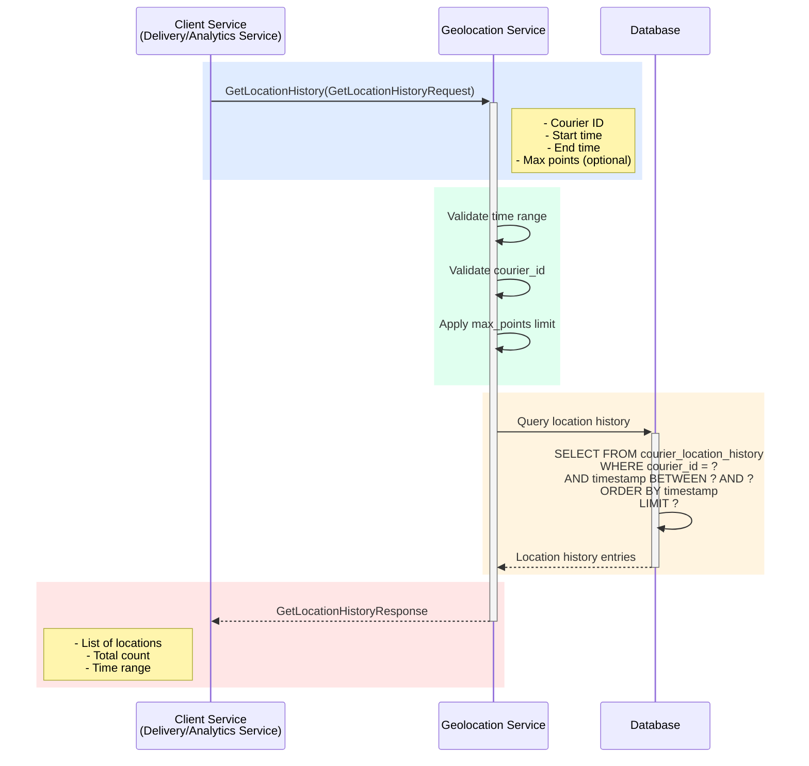

## Use Case: UC-3 Get Location History

### Описание
Получение истории геолокаций курьера за указанный период времени. Используется для анализа маршрутов, отслеживания перемещений и оптимизации доставок.

### Sequence Diagram



### Request

```protobuf
message GetLocationHistoryRequest {
  string courier_id = 1;
  google.protobuf.Timestamp start_time = 2;
  google.protobuf.Timestamp end_time = 3;
  optional int32 max_points = 4; // Максимум точек для возврата (для оптимизации)
  optional bool simplify = 5; // Упрощение маршрута (удаление близких точек)
}
```

### Response

```protobuf
message GetLocationHistoryResponse {
  string courier_id = 1;
  repeated LocationHistoryEntry entries = 2;
  google.protobuf.Timestamp start_time = 3;
  google.protobuf.Timestamp end_time = 4;
  int32 total_count = 5; // Общее количество точек в истории за период
  bool has_more = 6; // true если есть еще данные (из-за max_points)
}

message LocationHistoryEntry {
  Location location = 1;
  google.protobuf.Timestamp recorded_at = 2; // Время записи в БД
}
```

### Business Rules

1. **Валидация параметров:**
   - Courier ID должен быть непустым
   - Start time должен быть раньше end time
   - Максимальный период: 30 дней (для производительности)
   - Max points: минимум 1, максимум 10000

2. **Обработка времени:**
   - Если start_time не указан, используется 24 часа назад
   - Если end_time не указан, используется текущее время
   - Время приводится к UTC

3. **Оптимизация (simplify):**
   - Если `simplify = true`, удаляются точки, находящиеся очень близко друг к другу (< 10 метров)
   - Используется алгоритм Douglas-Peucker или аналогичный
   - Помогает уменьшить объем данных для длинных маршрутов

4. **Ограничения:**
   - Максимальный период запроса: 30 дней
   - Максимальное количество точек: 10000
   - Если данных больше, используется `max_points` или `has_more = true`

5. **Сортировка:**
   - Точки возвращаются в хронологическом порядке (от старых к новым)
   - Индекс по `(courier_id, timestamp)` обеспечивает быстрый запрос

### Хранение данных

**Таблица: `courier_location_history`**
- Партиционирование: по дате (месяц или день) для оптимизации запросов
- Индексы:
  - `(courier_id, timestamp)` - основной индекс
  - `timestamp` - для временных запросов
- TTL: автоматическое удаление записей старше 90 дней (настраиваемо)

### Оптимизация

**Для больших периодов:**
- Использование партиционирования по дате
- Применение `max_points` для ограничения количества точек
- Использование `simplify` для упрощения маршрута
- Пагинация для очень длинных периодов

**Производительность:**
- 1 день: ~50-200ms (зависит от частоты обновлений)
- 7 дней: ~200-500ms
- 30 дней: ~500ms-2s (может потребоваться оптимизация)

### Error Cases

- `INVALID_REQUEST`: Некорректный запрос (пустой courier_id, некорректный период)
- `COURIER_NOT_FOUND`: Курьер с указанным ID не найден
- `INVALID_TIME_RANGE`: Некорректный временной диапазон (start_time > end_time)
- `TIME_RANGE_TOO_LARGE`: Период запроса больше 30 дней
- `TOO_MANY_POINTS`: Запрошено больше 10000 точек (нужно использовать max_points)
- `DATABASE_ERROR`: Ошибка при запросе к базе данных

### Примеры использования

**Пример 1: Получение истории за последние 24 часа**

```protobuf
GetLocationHistoryRequest {
  courier_id: "courier_123"
  start_time: "2024-01-14T10:00:00Z"
  end_time: "2024-01-15T10:00:00Z"
}
```

**Ответ:**

```protobuf
GetLocationHistoryResponse {
  courier_id: "courier_123"
  entries: [
    {
      location: {
        latitude: 52.520008
        longitude: 13.404954
        accuracy: 15.5
        timestamp: "2024-01-14T10:00:00Z"
        speed: 0.0
      }
      recorded_at: "2024-01-14T10:00:01Z"
    }
    {
      location: {
        latitude: 52.521000
        longitude: 13.405000
        accuracy: 12.0
        timestamp: "2024-01-14T10:05:00Z"
        speed: 25.0
        heading: 90.0
      }
      recorded_at: "2024-01-14T10:05:01Z"
    }
    // ... more entries
  ]
  start_time: "2024-01-14T10:00:00Z"
  end_time: "2024-01-15T10:00:00Z"
  total_count: 48
  has_more: false
}
```

**Пример 2: Получение упрощенного маршрута за неделю**

```protobuf
GetLocationHistoryRequest {
  courier_id: "courier_123"
  start_time: "2024-01-08T00:00:00Z"
  end_time: "2024-01-15T00:00:00Z"
  max_points: 1000
  simplify: true
}
```

**Пример 3: Получение маршрута доставки**

```protobuf
// Получить маршрут курьера во время конкретной доставки
GetLocationHistoryRequest {
  courier_id: "courier_123"
  start_time: "2024-01-15T10:00:00Z" // Начало доставки
  end_time: "2024-01-15T11:30:00Z"   // Конец доставки
}
```

### Интеграция

**Используется в:**

1. **Analytics Service:**
   - Анализ эффективности маршрутов
   - Расчет времени доставки
   - Выявление проблемных участков

2. **Delivery Service:**
   - Отслеживание маршрута курьера
   - Воспроизведение маршрута для клиента
   - Проверка соответствия маршрута плану

3. **Admin/Dashboard:**
   - Визуализация маршрутов курьеров на карте
   - Отчеты по перемещениям
   - Анализ рабочего времени

4. **Support Service:**
   - Разбор проблем с доставкой
   - Проверка фактического маршрута vs планируемого

### Рекомендации

- Для визуализации на карте используйте `simplify = true` и `max_points = 500-1000`
- Для точного анализа используйте полную историю без упрощения
- Для длительных периодов (>7 дней) рекомендуется использовать пагинацию или ограничение по `max_points`
- История хранится 90 дней, для более длительного хранения используйте архивирование

