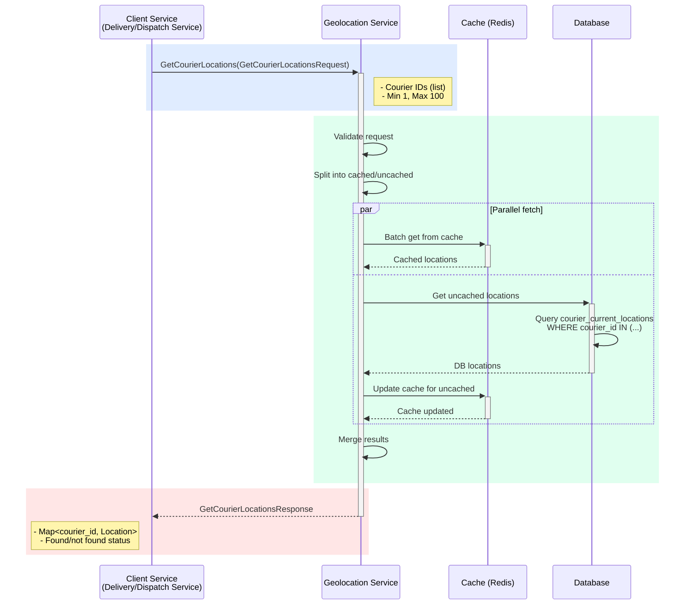

## Use Case: UC-2 Get Courier Locations

### Описание
Получение текущих геолокаций одного или нескольких курьеров одновременно. Используется для получения локации одного курьера (простой случай) или множества курьеров (диспетчеризация и массовые операции). Оптимизировано для быстрого получения локаций как одного, так и большого количества курьеров.

**Примечание:** Этот use case объединяет функциональность получения локации одного курьера (передайте массив с одним элементом) и нескольких курьеров одновременно. Это упрощает API и избегает дублирования логики.

### Sequence Diagram



### Request

```protobuf
message GetCourierLocationsRequest {
  repeated string courier_ids = 1; // Минимум 1, максимум 100. Для одного курьера передайте массив с одним элементом
}
```

### Response

```protobuf
message GetCourierLocationsResponse {
  map<string, LocationInfo> locations = 1; // courier_id -> location info
}

message LocationInfo {
  Location location = 1;
  google.protobuf.Timestamp last_updated = 2;
  bool found = 3; // true если локация найдена
}
```

### Business Rules

1. **Ограничения:**
   - Минимум 1 courier_id в запросе
   - Максимум 100 courier_ids в одном запросе
   - Если больше 100, возвращается ошибка `TOO_MANY_REQUESTS`

2. **Оптимизация:**
   - Сначала проверяется кэш (Redis) для всех запрошенных courier_ids
   - Только отсутствующие в кэше запрашиваются из базы данных
   - Используется батчинг для массовых запросов к БД

3. **Результат:**
   - Возвращается map всех запрошенных courier_ids
   - Если локация не найдена, `found = false`, `location` пустое
   - Если локация найдена, возвращается полная информация

4. **Кэширование:**
   - Найденные локации обновляются в кэше
   - Ключи: `courier:{courier_id}:location`
   - TTL: 5 минут

5. **Обработка несуществующих курьеров:**
   - Если курьер не существует, его ID все равно возвращается в ответе с `found = false`
   - Это позволяет клиенту различать "курьер не найден" и "локация не найдена"

### Оптимизация производительности

**Стратегия:**
1. **Batch cache lookup:** Множественный запрос к Redis за один раз (MGET)
2. **Batch DB query:** Один SQL запрос для всех отсутствующих в кэше courier_ids
3. **Parallel execution:** Параллельная обработка кэша и БД (если нужно)
4. **Cache warming:** Обновление кэша для всех найденных локаций

**Производительность:**
- 10 курьеров: ~10-20ms (в основном из кэша)
- 50 курьеров: ~20-50ms (смешанный кэш/БД)
- 100 курьеров: ~50-100ms (максимальный размер запроса)

### Error Cases

- `INVALID_REQUEST`: Пустой список courier_ids
- `TOO_MANY_REQUESTS`: Больше 100 courier_ids в запросе
- `DATABASE_ERROR`: Ошибка при запросе к базе данных

### Примеры использования

**Пример 1: Получение локации одного курьера**

```protobuf
GetCourierLocationsRequest {
  courier_ids: ["courier_123"]
}
```

**Ответ:**

```protobuf
GetCourierLocationsResponse {
  locations: {
    "courier_123": {
      location: {
        latitude: 52.520008
        longitude: 13.404954
        accuracy: 15.5
        timestamp: "2024-01-15T10:30:00Z"
        speed: 35.0
        heading: 180.0
      }
      last_updated: "2024-01-15T10:30:00Z"
      found: true
    }
  }
}
```

**Пример 2: Получение локаций нескольких курьеров для диспетчеризации**

```protobuf
GetCourierLocationsRequest {
  courier_ids: ["courier_123", "courier_456", "courier_789"]
}
```

**Ответ:**

```protobuf
GetCourierLocationsResponse {
  locations: {
    "courier_123": {
      location: {
        latitude: 52.520008
        longitude: 13.404954
        accuracy: 15.5
        timestamp: "2024-01-15T10:30:00Z"
        speed: 35.0
        heading: 180.0
      }
      last_updated: "2024-01-15T10:30:00Z"
      found: true
    }
    "courier_456": {
      location: {
        latitude: 52.493820
        longitude: 13.428290
        accuracy: 20.0
        timestamp: "2024-01-15T10:29:45Z"
      }
      last_updated: "2024-01-15T10:29:45Z"
      found: true
    }
    "courier_789": {
      found: false
    }
  }
}
```

**Пример 3: Проверка локаций всех свободных курьеров**

```protobuf
// Delivery Service получает список свободных курьеров
// Затем запрашивает их локации для диспетчеризации
GetCourierLocationsRequest {
  courier_ids: ["courier_001", "courier_002", "courier_003", ...]
}
```

### Интеграция

**Основное использование:**
- **Dispatch Service (Диспетчеризация):** Получение локаций всех свободных курьеров для выбора ближайшего к точке забора
- **Delivery Service:** Массовое обновление локаций курьеров в UI
- **Monitoring/Analytics:** Получение текущих позиций всех активных курьеров

**Использование в Assign Order use case:**
1. Dispatch Service получает список доступных курьеров
2. Запрашивает их локации через `GetCourierLocations`
3. Рассчитывает расстояния до точки забора
4. Выбирает ближайшего курьера

### Рекомендации

- Для одного курьера: передайте массив с одним элементом `["courier_id"]`
- Для нескольких курьеров: используйте этот метод вместо множественных отдельных вызовов
- Кэширование значительно ускоряет повторные запросы
- Для больших объемов (>100 курьеров) делайте несколько параллельных запросов
- Метод оптимизирован как для одного, так и для множества курьеров

