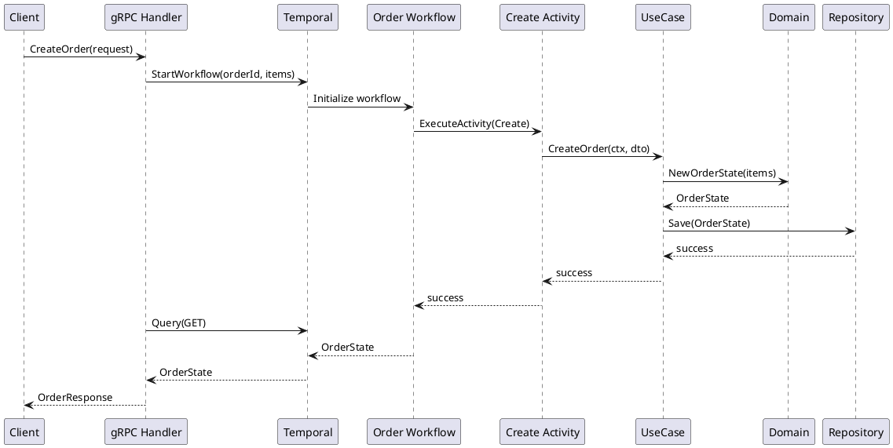

# 4. Hexagonal Architecture with Temporal

Date: 2026-01-31

## Status

Accepted

## Context

OMS uses Temporal for workflow orchestration ([ADR-0003](./0003-temporal.md)). We need clear architectural boundaries that:

- Keep Temporal concerns separate from business logic
- Allow testing domain logic without Temporal infrastructure
- Enable swapping adapters (HTTP, gRPC, Kafka) without affecting business rules
- Maintain clean dependency direction (outer layers depend on inner)

## Decision

Adopt **Hexagonal Architecture** (Ports & Adapters) combined with **Clean Architecture** principles, with Temporal workers positioned in the Adapters layer.

### Architecture Diagram

```text
┌────────────────────────────────────────────────────────────────────────────┐
│                              DELIVERY / ADAPTERS                           │
│                                                                            │
│  HTTP (chi)    gRPC (connect/grpc)     Kafka/Watermill consumer     CLI    │
│     │                 │                       │                      │     │
└─────┼─────────────────┼───────────────────────┼──────────────────────┼─────┘
      │                 │                       │                      │
      ▼                 ▼                       ▼                      ▼
┌────────────────────────────────────────────────────────────────────────────┐
│                         TEMPORAL WORKER (ADAPTER)                          │
│                                                                            │
│  ┌───────────────┐              ┌──────────────────────────────────────┐   │
│  │   Workflow    │   calls      │              Activities              │   │
│  │(deterministic)├─────────────▶│ (side-effects allowed: DB/HTTP/etc.) │   │
│  └───────────────┘              └──────────────────────────────────────┘   │
│                                          │                                 │
└──────────────────────────────────────────┼─────────────────────────────────┘
                                           │ calls
                                           ▼
┌────────────────────────────────────────────────────────────────────────────┐
│                         APPLICATION LAYER (USECASES)                       │
│                                                                            │
│   Commands / Queries / Interactors / ApplicationService                    │
│   - orchestration of business steps (NOT Temporal orchestration)           │
│   - transactions boundary                                                  │
│   - idempotency keys / dedupe logic                                        │
│   - emits domain events / integration events                               │
│                                                                            │
│   e.g. PayOrder, CreateBooking, Reprice, IssueTicket, etc.                 │
└──────────────────────────────────────────┼─────────────────────────────────┘
                                           │ uses
                                           ▼
┌────────────────────────────────────────────────────────────────────────────┐
│                             DOMAIN (DDD CORE)                              │
│                                                                            │
│   Entities / Aggregates / Value Objects / Domain Services                  │
│   - invariants                                                             │
│   - pure business rules                                                    │
│   - no DB, no HTTP, no Temporal, no logging libs required                  │
└──────────────────────────────────────────┼─────────────────────────────────┘
                                           │ depends on abstractions
                                           ▼
┌────────────────────────────────────────────────────────────────────────────┐
│                    PORTS (INTERFACES) / BOUNDARIES                         │
│                                                                            │
│   Repository interfaces      External gateway interfaces     EventBus port │
│   (OrderRepo, ...)           (PaymentProvider, ...)          (Publisher)   │
└──────────────────────────────────────────┼─────────────────────────────────┘
                                           │ implemented by
                                           ▼
┌────────────────────────────────────────────────────────────────────────────┐
│                          INFRASTRUCTURE (ADAPTERS)                         │
│                                                                            │
│  Postgres/pgx repos   Redis   HTTP clients   gRPC clients   Kafka producer │
│  Outbox/CDC           OTel exporters/logging/tracing wiring                │
└────────────────────────────────────────────────────────────────────────────┘
```

### Layer Responsibilities

| Layer | Responsibility | Allowed Dependencies |
|-------|---------------|---------------------|
| **Delivery/Adapters** | HTTP/gRPC handlers, CLI commands, message consumers | Application Layer, DTOs |
| **Temporal Worker** | Workflow orchestration, Activity definitions | Application Layer |
| **Application (UseCases)** | Business orchestration, transactions, events | Domain, Ports |
| **Domain** | Business rules, invariants, aggregates | None (pure) |
| **Ports** | Interface definitions | None |
| **Infrastructure** | Concrete implementations | Ports (implements) |

### Placement Rules

#### Workflow (Deterministic)

Workflows are **orchestration only**:

- ✅ Call Activities via `workflow.ExecuteActivity()`
- ✅ Use Temporal primitives (signals, queries, timers)
- ✅ Manage workflow state (in-memory during execution)
- ❌ No repository/database calls
- ❌ No HTTP/gRPC calls
- ❌ No logging side-effects
- ❌ No random/time-based decisions (use `workflow.Now()`)

```go
// Good: Workflow only orchestrates
func OrderWorkflow(ctx workflow.Context, orderId uuid.UUID) error {
    // Signal handling
    selector.AddReceive(cancelChannel, func(c workflow.ReceiveChannel, _ bool) {
        workflow.ExecuteActivity(ctx, CancelOrderActivity, orderId)
    })
}
```

#### Activities (Side-Effects Wrapper)

Activities are **thin adapters** that bridge Temporal → UseCase:

- ✅ Call UseCases/ApplicationServices
- ✅ Handle Temporal-specific retry/timeout configuration
- ✅ Map between Temporal types and domain types
- ❌ No business logic (delegate to UseCase)
- ❌ No direct database access (delegate to UseCase → Repository)

```go
// Good: Activity delegates to UseCase
func CancelOrderActivity(ctx context.Context, orderId uuid.UUID) error {
    return uc.CancelOrder(ctx, orderId)
}
```

#### UseCase / ApplicationService

UseCases contain **business coordination**:

- ✅ Orchestrate multiple domain operations
- ✅ Manage transaction boundaries
- ✅ Handle idempotency (dedupe keys)
- ✅ Emit domain events / integration events
- ✅ Call repository interfaces (ports)
- ❌ No Temporal-specific code
- ❌ No HTTP/gRPC handling

```go
// Good: UseCase handles business logic
func (uc *UC) CancelOrder(ctx context.Context, orderId uuid.UUID) error {
    order, err := uc.orderRepo.Get(ctx, orderId)
    if err != nil {
        return err
    }
    
    if err := order.Cancel(); err != nil { // Domain method
        return err
    }
    
    return uc.orderRepo.Save(ctx, order)
}
```

#### Domain (Pure Business Logic)

Domain layer contains **invariants and behavior**:

- ✅ Aggregate state transitions
- ✅ Business rule validation
- ✅ Value Objects
- ✅ Domain Events (in-memory)
- ❌ No I/O (database, HTTP, messaging)
- ❌ No framework dependencies
- ❌ No Temporal imports

```go
// Good: Domain aggregate with invariants
func (o *OrderState) Cancel() error {
    if o.status == StatusDelivered {
        return ErrCannotCancelDeliveredOrder
    }
    o.status = StatusCancelled
    o.AddDomainEvent(OrderCancelledEvent{OrderId: o.id})
    return nil
}
```

#### Repository / Infrastructure

Infrastructure implements **port interfaces**:

- ✅ Concrete database implementations (Postgres, Redis)
- ✅ External API clients
- ✅ Message producers (Kafka)
- ✅ Observability wiring (OTel, logging)
- ❌ No business logic

### Directory Mapping

```text
oms/
├── internal/
│   ├── domain/              # Domain Layer
│   │   ├── cart/v1/
│   │   │   ├── state.go           # Cart aggregate
│   │   │   ├── item/v1/           # Value objects
│   │   │   └── events/v1/         # Domain events
│   │   ├── order/v1/
│   │   │   ├── order_state.go     # Order aggregate
│   │   │   └── vo/                # Value objects
│   │   └── services/              # Domain services
│   │
│   ├── usecases/            # Application Layer
│   │   ├── cart/
│   │   │   ├── usecase.go         # Cart UC (interface)
│   │   │   ├── add.go             # AddItem command
│   │   │   └── get.go             # GetCart query
│   │   └── order/
│   │       ├── usecase.go
│   │       └── create.go
│   │
│   ├── workers/             # Temporal Adapters
│   │   ├── cart/
│   │   │   ├── workflow/          # Cart workflow
│   │   │   └── cart_worker/       # Worker registration
│   │   └── order/
│   │       ├── workflow/          # Order workflow
│   │       └── order_worker/
│   │
│   └── infrastructure/      # Infrastructure Adapters
│       ├── rpc/                   # gRPC handlers
│       ├── http/                  # HTTP handlers
│       └── temporal/              # Temporal config
```

### Data Flow Example

Order creation flow:

```text
1. Client → gRPC Handler (Adapter)
2. gRPC Handler → Temporal Client (start workflow)
3. Temporal Server → Order Worker (dispatch)
4. Workflow → Activity (signal to create)
5. Activity → UseCase.CreateOrder()
6. UseCase → Domain.OrderState.Create()
7. UseCase → Repository.Save() (port → infrastructure)
8. Query → Workflow state returned to client
```



## Consequences

### Positive

- **Testability**: Domain and UseCases can be unit tested without Temporal
- **Flexibility**: Easy to add new delivery mechanisms (WebSocket, CLI)
- **Clarity**: Clear responsibility boundaries for each layer
- **Maintainability**: Changes in infrastructure don't affect business logic
- **Portability**: Could switch from Temporal to another orchestrator

### Negative

- **Indirection**: More layers mean more files and mapping code
- **Learning Curve**: Team must understand layer boundaries
- **DTO Mapping**: Conversion between layers adds boilerplate

### Trade-offs

| Concern | Decision |
|---------|----------|
| Where to put Temporal? | Adapter layer (like HTTP/gRPC) |
| Activities call what? | UseCases only, not repositories directly |
| Can workflows have business logic? | No, only orchestration logic |
| Where are transactions? | UseCase layer |

## References

- [ADR-0003: Use Temporal](./0003-temporal.md)
- [Hexagonal Architecture](https://alistair.cockburn.us/hexagonal-architecture/)
- [Clean Architecture](https://blog.cleancoder.com/uncle-bob/2012/08/13/the-clean-architecture.html)
- [Temporal Workflow Determinism](https://docs.temporal.io/workflows#determinism)
- [Workers README](../../../internal/workers/README.md)
