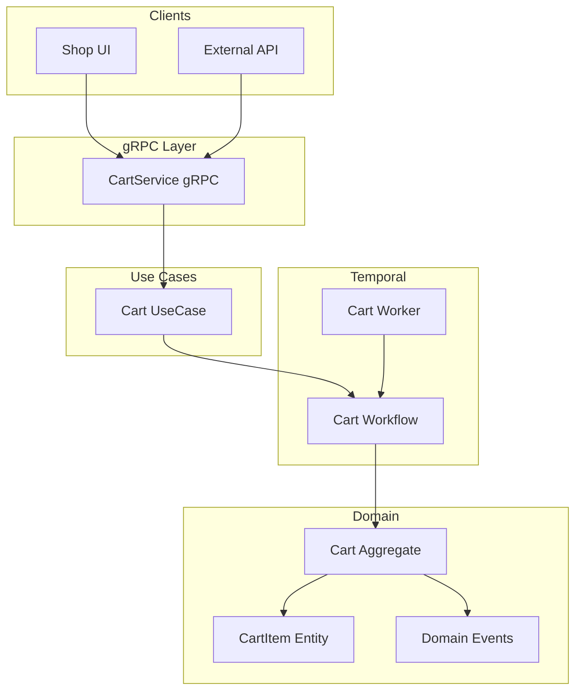
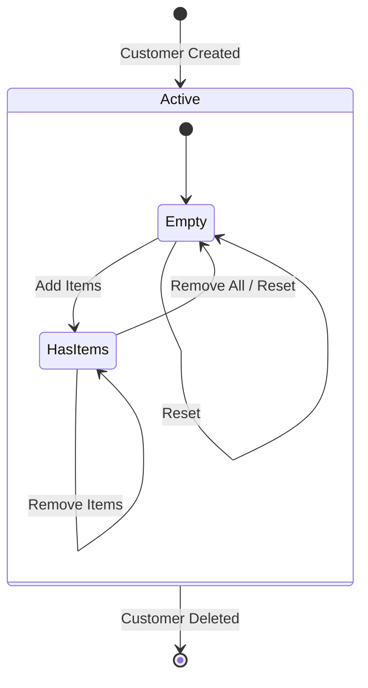
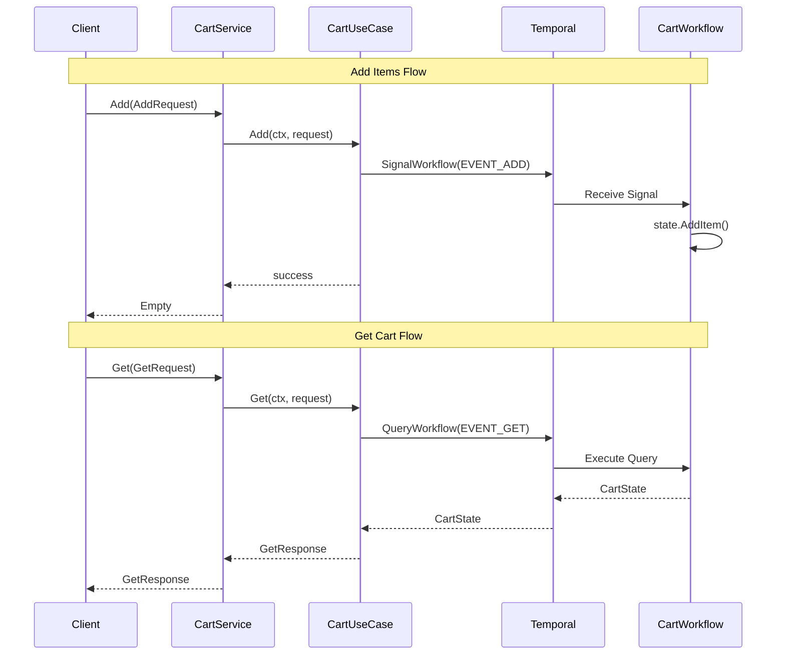

# Cart Use Cases

## Overview

The Cart domain manages shopping cart operations for customers. Each customer has exactly one cart that persists across sessions using Temporal workflows. The cart supports adding, removing, and querying items, as well as automatic cleanup when stock is depleted.

### Key Features

- **Long-running Workflow**: Cart state is managed by a Temporal workflow per customer
- **Signal-based Operations**: Add/Remove/Reset operations are sent as signals to the workflow
- **Query Support**: Cart state can be queried without affecting the workflow
- **Stock Integration**: Automatic item removal when stock is depleted (see [STOCK_CHANGES.md](STOCK_CHANGES.md))

## Architecture



## State Machine

The cart operates as a continuous state machine where all operations are valid from any state:



## API Reference

### gRPC Service

**Package**: `infrastructure.rpc.cart.v1`

```protobuf
service CartService {
  rpc Add(AddRequest) returns (google.protobuf.Empty);
  rpc Remove(RemoveRequest) returns (google.protobuf.Empty);
  rpc Get(GetRequest) returns (GetResponse);
  rpc Reset(ResetRequest) returns (google.protobuf.Empty);
}
```

### Add Items

Adds one or more items to the customer's cart. If an item already exists, quantities are summed.

**Request:**
```json
{
  "customer_id": "550e8400-e29b-41d4-a716-446655440000",
  "items": [
    { "good_id": "123e4567-e89b-12d3-a456-426614174000", "quantity": 2 },
    { "good_id": "987fcdeb-51a2-3bc4-d567-890123456789", "quantity": 1 }
  ]
}
```

**Response:** `Empty`

### Remove Items

Removes items from the cart. If quantity becomes zero or negative, the item is removed entirely.

**Request:**
```json
{
  "customer_id": "550e8400-e29b-41d4-a716-446655440000",
  "items": [
    { "good_id": "123e4567-e89b-12d3-a456-426614174000", "quantity": 1 }
  ]
}
```

**Response:** `Empty`

### Get Cart

Retrieves the current cart state for a customer.

**Request:**
```json
{
  "customer_id": "550e8400-e29b-41d4-a716-446655440000"
}
```

**Response:**
```json
{
  "state": {
    "cart_id": "cart-550e8400",
    "customer_id": "550e8400-e29b-41d4-a716-446655440000",
    "items": [
      { "good_id": "123e4567-e89b-12d3-a456-426614174000", "quantity": 2 }
    ],
    "created_at": "2024-01-15T10:30:00Z",
    "updated_at": "2024-01-15T11:45:00Z"
  }
}
```

### Reset Cart

Clears all items from the cart.

**Request:**
```json
{
  "customer_id": "550e8400-e29b-41d4-a716-446655440000"
}
```

**Response:** `Empty`

## Temporal Workflow

### Workflow Details

| Property | Value |
|----------|-------|
| Task Queue | `CART_TASK_QUEUE` |
| Workflow ID | `cart-{customer_id}` |
| Lifetime | Long-running (until customer deleted) |

### Signals

| Signal | Payload | Description |
|--------|---------|-------------|
| `EVENT_ADD` | `CartEvent` | Add items to cart |
| `EVENT_REMOVE` | `CartEvent` | Remove items from cart |
| `EVENT_RESET` | `string` (customer_id) | Clear cart |

### Queries

| Query | Response | Description |
|-------|----------|-------------|
| `EVENT_GET` | `CartState` | Get current cart state |

### Sequence Diagram



## Error Handling

### Error Codes

| Code | Description | Recovery |
|------|-------------|----------|
| `INVALID_ARGUMENT` | Invalid customer_id or good_id format | Fix UUID format |
| `NOT_FOUND` | Workflow not found for customer | Create customer first |
| `INTERNAL` | Temporal communication error | Retry with backoff |

### Domain Validation Rules

Items are validated before being added to cart:

| Rule | Description |
|------|-------------|
| `GoodIdNotEmpty` | good_id must be a valid UUID |
| `QuantityPositive` | quantity must be > 0 |
| `PriceNonNegative` | price must be >= 0 |
| `DiscountNonNegative` | discount must be >= 0 |
| `DiscountNotExceedsPrice` | discount <= price |
| `TaxNonNegative` | tax must be >= 0 |

## Integration

### Stock Changes

When inventory reaches zero, items are automatically removed from all carts containing that product. See [STOCK_CHANGES.md](STOCK_CHANGES.md) for details.

### WebSocket Notifications

Customers receive real-time notifications when items are removed due to stock depletion:

```javascript
const ws = new WebSocket(`ws://oms:50051/ws?customer_id=${customerId}`);
ws.onmessage = (event) => {
  const { type, data } = JSON.parse(event.data);
  if (type === 'stock_depleted') {
    // Refresh cart UI
  }
};
```

### Creating Orders from Cart

The Order service can create an order from the current cart state:

```go
// Get cart state
cartState := cartUC.Get(ctx, customerId)

// Create order from cart items
order := orderUC.CreateFromCart(ctx, cartState)
```
