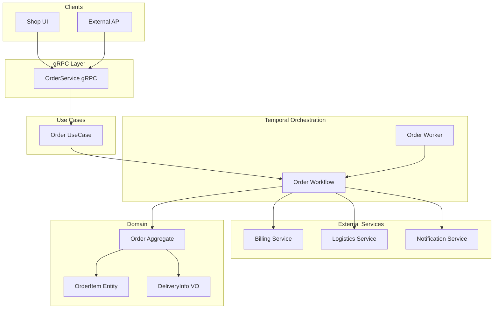
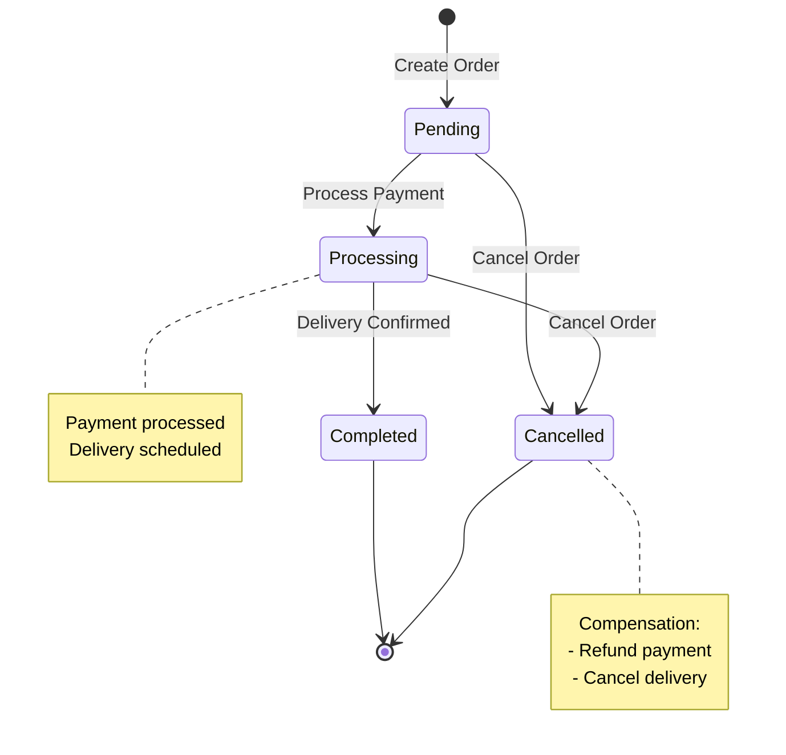
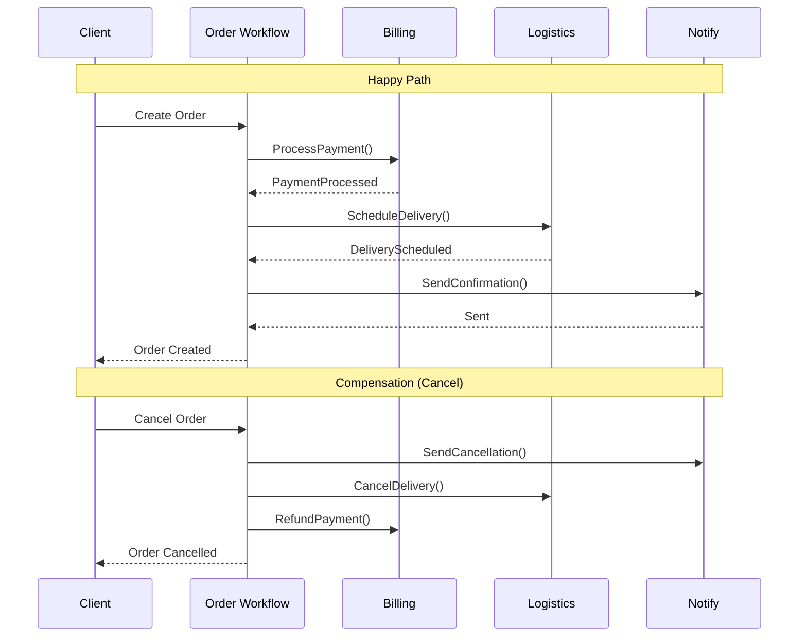

# Order Use Cases

## Overview

The Order domain manages the complete order lifecycle from creation to completion or cancellation. Orders are created from cart contents and orchestrated using Temporal workflows to ensure reliable processing across multiple services (billing, logistics, notifications).

### Key Features

- **Saga Pattern**: Distributed transactions with compensation logic
- **Temporal Orchestration**: Reliable workflow execution with automatic retries
- **Status Tracking**: Real-time order status updates
- **Delivery Integration**: Package tracking and delivery scheduling

## Architecture



## Order States

| Status | Description | Next States |
|--------|-------------|-------------|
| `PENDING` | Order created, awaiting processing | `PROCESSING`, `CANCELLED` |
| `PROCESSING` | Payment and delivery in progress | `COMPLETED`, `CANCELLED` |
| `COMPLETED` | Order successfully fulfilled | - (final) |
| `CANCELLED` | Order cancelled by customer or system | - (final) |

### State Machine



## API Reference

### gRPC Service

**Package**: `infrastructure.rpc.order.v1`

```protobuf
service OrderService {
  rpc Create(CreateRequest) returns (google.protobuf.Empty);
  rpc Get(GetRequest) returns (GetResponse);
  rpc Cancel(CancelRequest) returns (google.protobuf.Empty);
}
```

### Create Order

Creates a new order from cart items and initiates the order processing workflow.

**Request:**
```json
{
  "order": {
    "customer_id": "550e8400-e29b-41d4-a716-446655440000",
    "items": [
      { "id": "123e4567-e89b-12d3-a456-426614174000", "quantity": 2, "price": 29.99 },
      { "id": "987fcdeb-51a2-3bc4-d567-890123456789", "quantity": 1, "price": 49.99 }
    ]
  }
}
```

**Response:** `Empty`

**Side Effects:**
1. Starts Temporal workflow
2. Processes payment via Billing Service
3. Schedules delivery via Logistics Service
4. Sends confirmation via Notification Service

### Get Order

Retrieves order details by ID.

**Request:**
```json
{
  "id": "order-550e8400-e29b-41d4-a716-446655440000"
}
```

**Response:**
```json
{
  "order": {
    "id": "order-550e8400-e29b-41d4-a716-446655440000",
    "customer_id": "550e8400-e29b-41d4-a716-446655440000",
    "items": [
      { "id": "123e4567-e89b-12d3-a456-426614174000", "quantity": 2, "price": 29.99 }
    ],
    "status": "ORDER_STATUS_PROCESSING",
    "created_at": "2024-01-15T10:30:00Z",
    "updated_at": "2024-01-15T10:35:00Z"
  }
}
```

### Cancel Order

Cancels an order and triggers compensation logic.

**Request:**
```json
{
  "id": "order-550e8400-e29b-41d4-a716-446655440000"
}
```

**Response:** `Empty`

**Compensation Actions:**
1. Refund payment via Billing Service
2. Cancel delivery via Logistics Service
3. Send cancellation notification

## Temporal Workflow

### Workflow Details

| Property | Value |
|----------|-------|
| Task Queue | `ORDER_TASK_QUEUE` |
| Workflow ID | `order-{order_id}` |
| Lifetime | Until completed or cancelled |

### Signals

| Signal | Description |
|--------|-------------|
| `CANCEL` | Cancel the order and trigger compensation |
| `COMPLETE` | Mark order as completed |

### Queries

| Query | Response | Description |
|-------|----------|-------------|
| `GET` | `OrderState` | Get current order state |

## Saga Pattern

The order creation follows the Saga pattern for distributed transactions:



### Compensation Logic

When an order is cancelled, compensating actions are executed in reverse order:

| Step | Action | Compensation |
|------|--------|--------------|
| 1 | Process Payment | Refund Payment |
| 2 | Schedule Delivery | Cancel Delivery |
| 3 | Send Confirmation | Send Cancellation |

## Delivery Integration

### Delivery Info

Orders include delivery information for logistics:

```json
{
  "delivery_info": {
    "pickup_address": {
      "street": "123 Warehouse St",
      "city": "Berlin",
      "postal_code": "10115",
      "country": "Germany",
      "latitude": 52.5200,
      "longitude": 13.4050
    },
    "delivery_address": {
      "street": "456 Customer Ave",
      "city": "Berlin",
      "postal_code": "10178",
      "country": "Germany",
      "latitude": 52.5170,
      "longitude": 13.3889
    },
    "delivery_period": {
      "start_time": "2024-01-16T09:00:00Z",
      "end_time": "2024-01-16T18:00:00Z"
    },
    "package_info": {
      "weight_kg": 2.5,
      "dimensions": "30x20x15"
    },
    "priority": "DELIVERY_PRIORITY_NORMAL"
  }
}
```

### Delivery Status

| Status | Description |
|--------|-------------|
| `ACCEPTED` | Package accepted by delivery service |
| `ASSIGNED` | Courier assigned |
| `IN_TRANSIT` | Package in delivery |
| `DELIVERED` | Successfully delivered |
| `NOT_DELIVERED` | Delivery failed (see reason) |

## Error Handling

### Error Codes

| Code | Description | Recovery |
|------|-------------|----------|
| `INVALID_ARGUMENT` | Invalid order data | Fix request data |
| `NOT_FOUND` | Order not found | Verify order ID |
| `FAILED_PRECONDITION` | Invalid state transition | Check current status |
| `INTERNAL` | Service error | Retry with backoff |

### Retry Policy

Temporal automatically retries failed activities:

```go
RetryPolicy: &temporal.RetryPolicy{
    InitialInterval:    time.Second,
    BackoffCoefficient: 2.0,
    MaximumInterval:    time.Minute,
    MaximumAttempts:    5,
}
```

## Integration

### Creating Order from Cart

```go
// Get cart state
cartState := cartUC.Get(ctx, customerId)

// Create order from cart
order := orderUC.CreateFromCart(ctx, &CreateFromCartRequest{
    CustomerID: customerId,
    Items:      cartState.Items,
})

// Reset cart after successful order creation
cartUC.Reset(ctx, customerId)
```

### Webhook Notifications

External services can subscribe to order status changes:

```json
POST /webhooks/order-status
{
  "order_id": "order-550e8400",
  "status": "ORDER_STATUS_COMPLETED",
  "timestamp": "2024-01-16T14:30:00Z"
}
```
