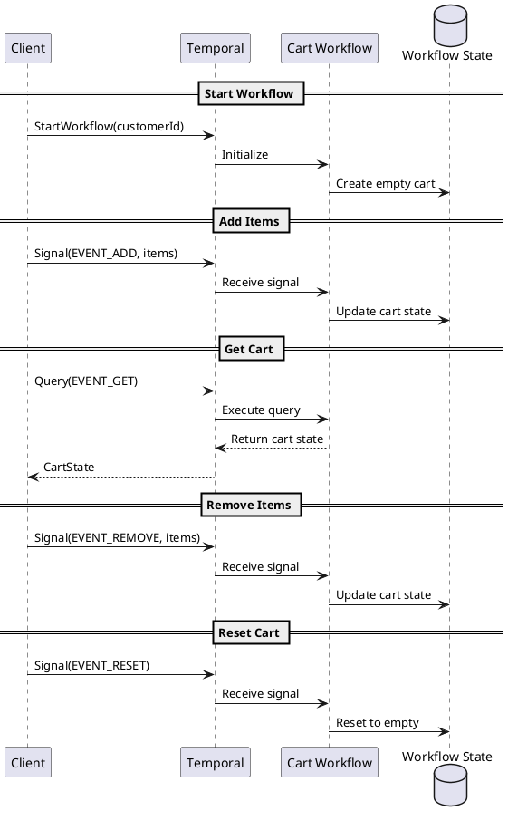
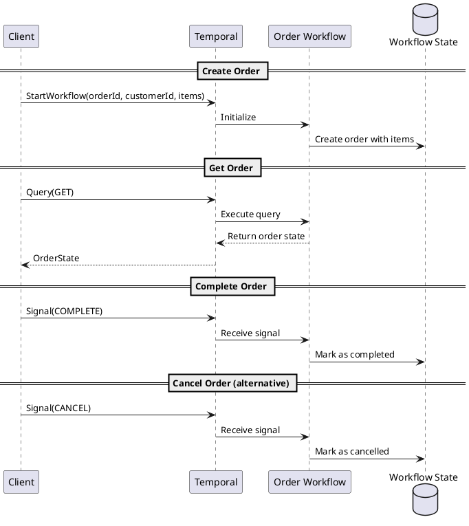

# Temporal Workers

This directory contains Temporal workflow workers for OMS.

## Overview

OMS uses [Temporal](https://temporal.io/) for durable workflow orchestration. Each aggregate (Cart, Order) has its own long-running workflow that manages state through signals and queries.

## Structure

```text
workers/
├── cart/
│   ├── workflow/
│   │   ├── workflow.go       # Cart workflow definition
│   │   ├── dto/              # Domain to workflow model mapping
│   │   └── model/            # Workflow-specific proto models
│   ├── cart_worker/
│   │   └── worker.go         # Temporal worker registration
│   └── di/                   # Dependency injection
└── order/
    ├── workflow/
    │   ├── workflow.go       # Order workflow definition
    │   ├── dto/
    │   └── model/
    ├── order_worker/
    │   └── worker.go
    └── di/
```

## Cart Workflow

Long-running workflow that manages shopping cart state.

### Cart Signals

| Signal         | Description                |
|----------------|----------------------------|
| `EVENT_ADD`    | Add items to cart          |
| `EVENT_REMOVE` | Remove items from cart     |
| `EVENT_RESET`  | Reset cart to empty state  |

### Cart Queries

| Query       | Description            |
|-------------|------------------------|
| `EVENT_GET` | Get current cart state |

### Cart Sequence Diagram



## Order Workflow

Long-running workflow that manages order lifecycle.

### Order Signals

| Signal     | Description               |
|------------|---------------------------|
| `CANCEL`   | Cancel the order          |
| `COMPLETE` | Mark order as completed   |

### Order Queries

| Query | Description              |
|-------|--------------------------|
| `GET` | Get current order state  |

### Order Sequence Diagram



## Task Queues

| Queue            | Temporal Name        | Purpose                    |
|------------------|----------------------|----------------------------|
| `CartTaskQueue`  | `CART_TASK_QUEUE`    | Cart workflow execution    |
| `OrderTaskQueue` | `ORDER_TASK_QUEUE`   | Order workflow execution   |

## Why Temporal?

See [ADR-0003](../../../docs/ADR/decisions/0003-temporal.md) for the decision rationale.

## Running Workers

Workers are started as part of the OMS service. Each worker polls its respective task queue for workflow tasks.

```go
// Cart worker
w := worker.New(c, temporal.GetQueueName(v1.CartTaskQueue), worker.Options{})
w.RegisterWorkflow(cart_workflow.Workflow)

// Order worker  
w := worker.New(c, temporal.GetQueueName(v1.OrderTaskQueue), worker.Options{})
w.RegisterWorkflow(order_workflow.Workflow)
```
